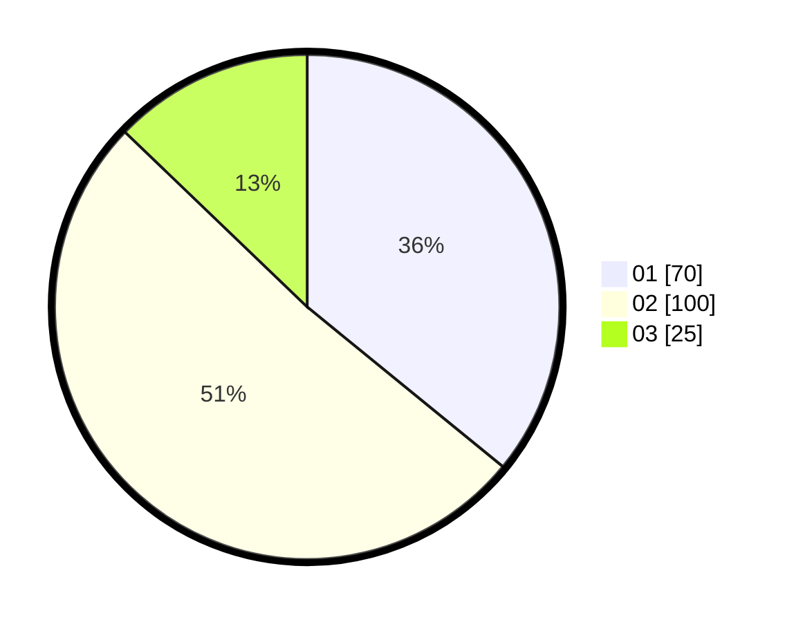

# Hasil

Hasil perolehan suara paslon dapat dilihat pada file paslon-01.txt, paslon-02.txt, dan paslon-03.txt.

Jika tidak ada, artinya data tersebut belum ada pada SIREKAP.

## Perolehan Suara

 * Paslon 01: **70**.
 * Paslon 02: **100**.
 * Paslon 03: **25**.

## Foto C Plano

https://sirekap-obj-formc.kpu.go.id/ea15/pemilu/ppwp/31/73/04/10/07/3173041007093-20240214-182601--6beeaba4-f2d5-4211-af33-db406471a9dc.jpg

https://sirekap-obj-formc.kpu.go.id/ea15/pemilu/ppwp/31/73/04/10/07/3173041007093-20240214-182604--481c9544-bcc0-4a04-8321-93313d75a45d.jpg

https://sirekap-obj-formc.kpu.go.id/ea15/pemilu/ppwp/31/73/04/10/07/3173041007093-20240214-182602--45ad5cb2-d1ee-4f78-b52a-73e3aa81942c.jpg

## DATA PEMILIH TETAP

Jumlah pemilih dalam DPT: **266**.
 * L: **131**.
 * P: **135**.

## DATA PENGGUNA HAK PILIH

Jumlah pengguna hak pilih dalam DPT: **198**.
 * L: **90**.
 * P: **108**.

Jumlah pengguna hak pilih dalam DPTb: **0**.
 * L: **0**.
 * P: **0**.

Jumlah pengguna hak pilih dalam DPK: **0**.
 * L: **0**.
 * P: **0**.

Jumlah pengguna hak pilih: **198**.
 * L: **90**.
 * P: **108**.

## JUMLAH SUARA SAH DAN TIDAK SAH

JUMLAH SELURUH SUARA SAH: **195**.

JUMLAH SUARA TIDAK SAH: **3**.

JUMLAH SELURUH SUARA SAH DAN SUARA TIDAK SAH: **198**.
