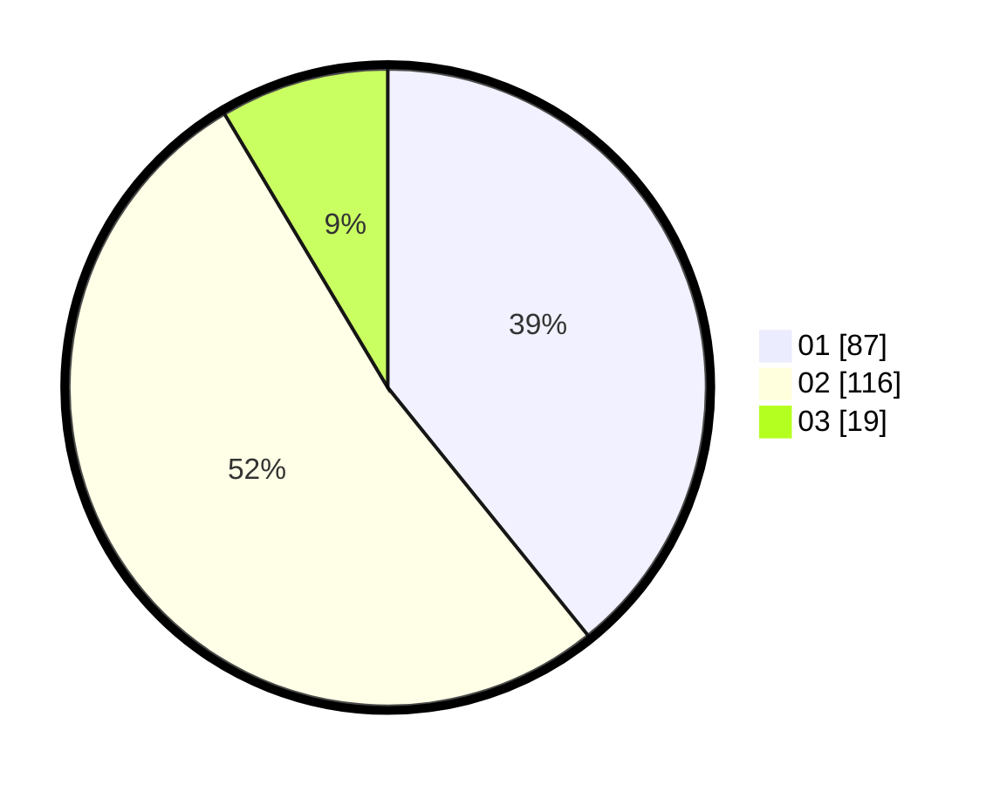

# Hasil

Hasil perolehan suara paslon dapat dilihat pada file paslon-01.txt, paslon-02.txt, dan paslon-03.txt.

Jika tidak ada, artinya data tersebut belum ada pada SIREKAP.

## Perolehan Suara

 * Paslon 01: **87**.
 * Paslon 02: **116**.
 * Paslon 03: **19**.

## Foto C Plano

https://sirekap-obj-formc.kpu.go.id/558e/pemilu/ppwp/31/73/04/10/07/3173041007094-20240214-192601--edb63d67-7a4c-486e-959a-872d0175c533.jpg

https://sirekap-obj-formc.kpu.go.id/558e/pemilu/ppwp/31/73/04/10/07/3173041007094-20240214-194452--6d7637d8-81a4-47a9-8a93-7f90638e60c0.jpg

https://sirekap-obj-formc.kpu.go.id/558e/pemilu/ppwp/31/73/04/10/07/3173041007094-20240214-194622--b20d05b9-e413-4a79-b4ff-492cd93d3046.jpg
