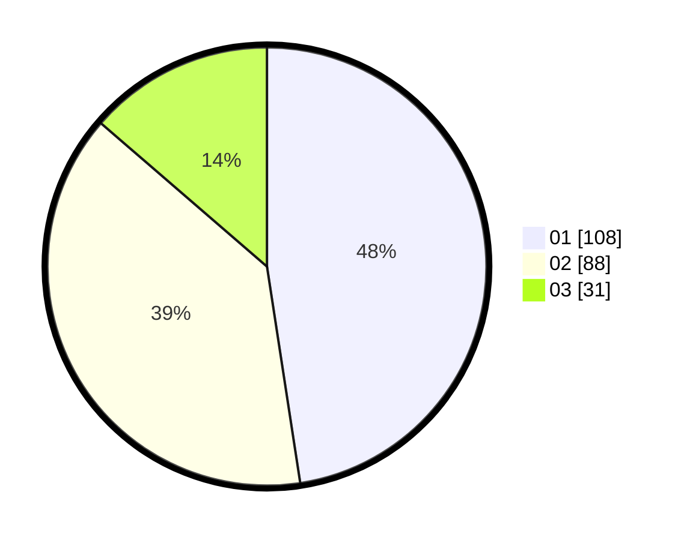

# Hasil

Hasil perolehan suara paslon dapat dilihat pada file paslon-01.txt, paslon-02.txt, dan paslon-03.txt.

Jika tidak ada, artinya data tersebut belum ada pada SIREKAP.

## Perolehan Suara

 * Paslon 01: **108**.
 * Paslon 02: **88**.
 * Paslon 03: **31**.

## Foto C Plano

https://sirekap-obj-formc.kpu.go.id/4752/pemilu/ppwp/31/73/04/10/07/3173041007095-20240214-214812--c24a4be1-6959-4273-8dd7-73ca6b33653e.jpg

https://sirekap-obj-formc.kpu.go.id/4752/pemilu/ppwp/31/73/04/10/07/3173041007095-20240214-215017--71a63729-5514-4931-877e-4a889005c128.jpg

https://sirekap-obj-formc.kpu.go.id/4752/pemilu/ppwp/31/73/04/10/07/3173041007095-20240214-215602--bef68a7d-821b-49fb-b05b-86f412717887.jpg
