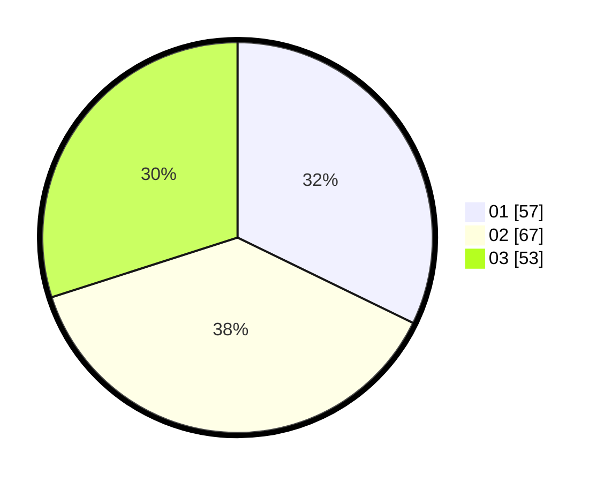

# Hasil

Hasil perolehan suara paslon dapat dilihat pada file paslon-01.txt, paslon-02.txt, dan paslon-03.txt.

Jika tidak ada, artinya data tersebut belum ada pada SIREKAP.

## Perolehan Suara

 * Paslon 01: **57**.
 * Paslon 02: **67**.
 * Paslon 03: **53**.

## Foto C Plano

https://sirekap-obj-formc.kpu.go.id/bca6/pemilu/ppwp/31/73/04/10/08/3173041008002-20240214-235606--de7e4138-465e-4ace-8ca2-b760322636e9.jpg

https://sirekap-obj-formc.kpu.go.id/bca6/pemilu/ppwp/31/73/04/10/08/3173041008002-20240214-191001--57f77979-b090-4b3b-b7ad-296705a36745.jpg

https://sirekap-obj-formc.kpu.go.id/bca6/pemilu/ppwp/31/73/04/10/08/3173041008002-20240214-191010--c6b98860-e98d-47f8-8489-23a07df220ce.jpg

## DATA PEMILIH TETAP

Jumlah pemilih dalam DPT: **250**.
 * L: **115**.
 * P: **135**.

## DATA PENGGUNA HAK PILIH

Jumlah pengguna hak pilih dalam DPT: **176**.
 * L: **83**.
 * P: **93**.

Jumlah pengguna hak pilih dalam DPTb: **0**.
 * L: **0**.
 * P: **0**.

Jumlah pengguna hak pilih dalam DPK: **5**.
 * L: **2**.
 * P: **3**.

Jumlah pengguna hak pilih: **181**.
 * L: **85**.
 * P: **96**.

## JUMLAH SUARA SAH DAN TIDAK SAH

JUMLAH SELURUH SUARA SAH: **177**.

JUMLAH SUARA TIDAK SAH: **4**.

JUMLAH SELURUH SUARA SAH DAN SUARA TIDAK SAH: **181**.
