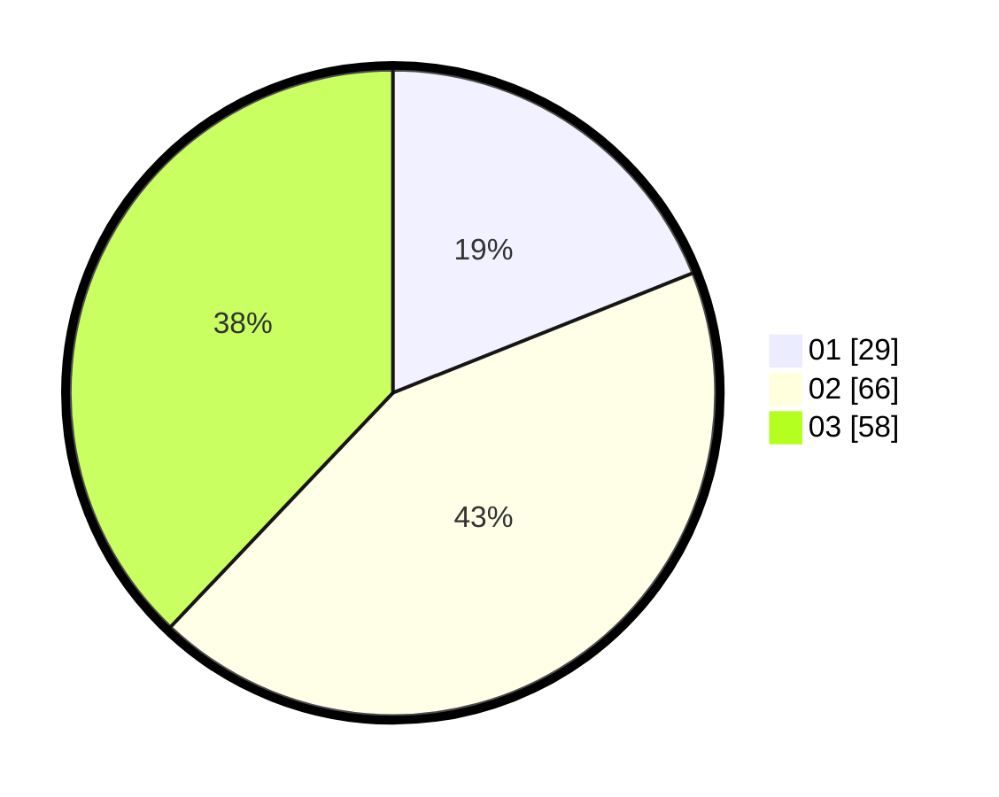

# Hasil

Hasil perolehan suara paslon dapat dilihat pada file paslon-01.txt, paslon-02.txt, dan paslon-03.txt.

Jika tidak ada, artinya data tersebut belum ada pada SIREKAP.

## Perolehan Suara

 * Paslon 01: **29**.
 * Paslon 02: **66**.
 * Paslon 03: **58**.

## Foto C Plano

https://sirekap-obj-formc.kpu.go.id/0134/pemilu/ppwp/31/73/04/10/08/3173041008008-20240214-185356--7879e42b-6fb6-41ce-bba4-1e9b1930d0e1.jpg

https://sirekap-obj-formc.kpu.go.id/0134/pemilu/ppwp/31/73/04/10/08/3173041008008-20240214-185522--70d93e6c-0678-44d1-b9f9-761ac1c730e3.jpg

https://sirekap-obj-formc.kpu.go.id/0134/pemilu/ppwp/31/73/04/10/08/3173041008008-20240214-221400--81e36856-b33c-41f9-8d31-45994ab29c21.jpg

## DATA PEMILIH TETAP

Jumlah pemilih dalam DPT: **226**.
 * L: **104**.
 * P: **122**.

## DATA PENGGUNA HAK PILIH

Jumlah pengguna hak pilih dalam DPT: **153**.
 * L: **73**.
 * P: **80**.

Jumlah pengguna hak pilih dalam DPTb: **1**.
 * L: **1**.
 * P: **0**.

Jumlah pengguna hak pilih dalam DPK: **1**.
 * L: **0**.
 * P: **1**.

Jumlah pengguna hak pilih: **155**.
 * L: **74**.
 * P: **81**.

## JUMLAH SUARA SAH DAN TIDAK SAH

JUMLAH SELURUH SUARA SAH: **153**.

JUMLAH SUARA TIDAK SAH: **2**.

JUMLAH SELURUH SUARA SAH DAN SUARA TIDAK SAH: **155**.
