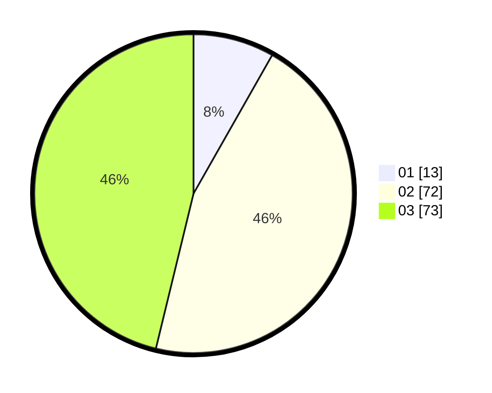

# Hasil

Hasil perolehan suara paslon dapat dilihat pada file paslon-01.txt, paslon-02.txt, dan paslon-03.txt.

Jika tidak ada, artinya data tersebut belum ada pada SIREKAP.

## Perolehan Suara

 * Paslon 01: **13**.
 * Paslon 02: **72**.
 * Paslon 03: **73**.

## Foto C Plano

https://sirekap-obj-formc.kpu.go.id/2f51/pemilu/ppwp/31/73/04/10/08/3173041008011-20240214-203704--338a7589-3bad-459a-9fb7-88cd7718a336.jpg

https://sirekap-obj-formc.kpu.go.id/2f51/pemilu/ppwp/31/73/04/10/08/3173041008011-20240214-203414--1c6a9af0-5c87-4515-a283-16bdfea46a1f.jpg

https://sirekap-obj-formc.kpu.go.id/2f51/pemilu/ppwp/31/73/04/10/08/3173041008011-20240214-203500--a0250ae2-d46a-4407-add3-c8999a617a95.jpg
