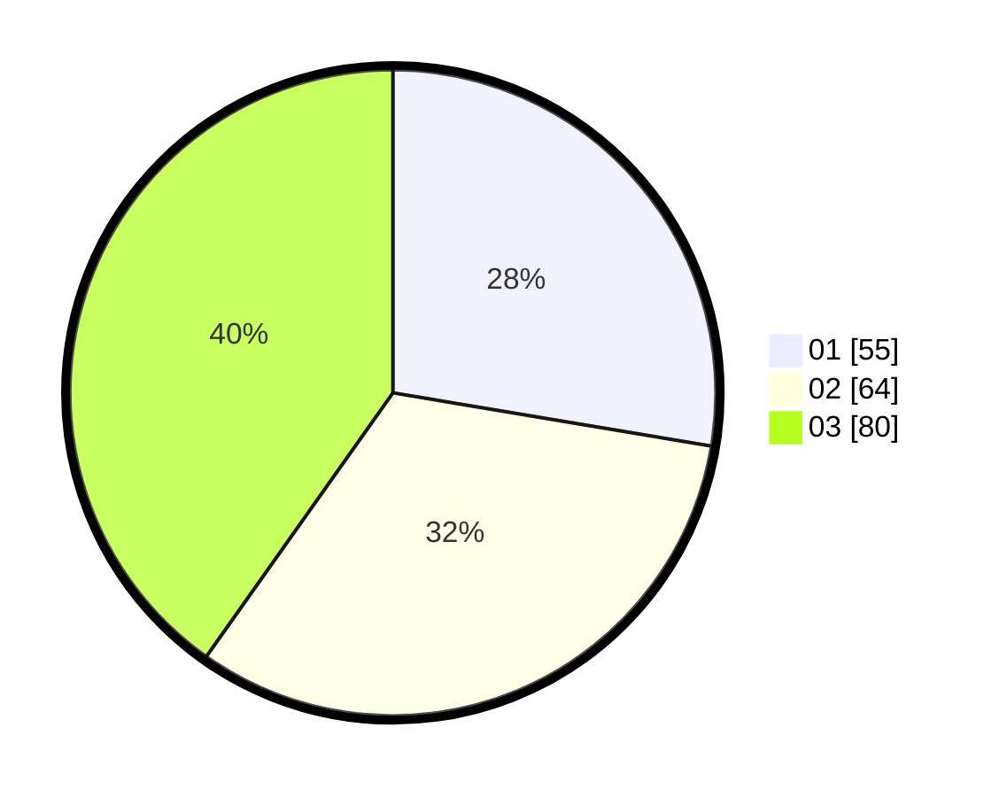

# Hasil

Hasil perolehan suara paslon dapat dilihat pada file paslon-01.txt, paslon-02.txt, dan paslon-03.txt.

Jika tidak ada, artinya data tersebut belum ada pada SIREKAP.

## Perolehan Suara

 * Paslon 01: **55**.
 * Paslon 02: **64**.
 * Paslon 03: **80**.

## Foto C Plano

https://sirekap-obj-formc.kpu.go.id/71ad/pemilu/ppwp/31/73/04/10/08/3173041008012-20240214-222500--842f2bfc-5af0-4e9a-b72b-28a21f6348b4.jpg

https://sirekap-obj-formc.kpu.go.id/71ad/pemilu/ppwp/31/73/04/10/08/3173041008012-20240214-222721--f0cf97b7-acc4-4fec-aece-3a50129492f0.jpg

https://sirekap-obj-formc.kpu.go.id/71ad/pemilu/ppwp/31/73/04/10/08/3173041008012-20240214-223159--e4c9310c-2a59-4b94-8822-3acd0e13a835.jpg
