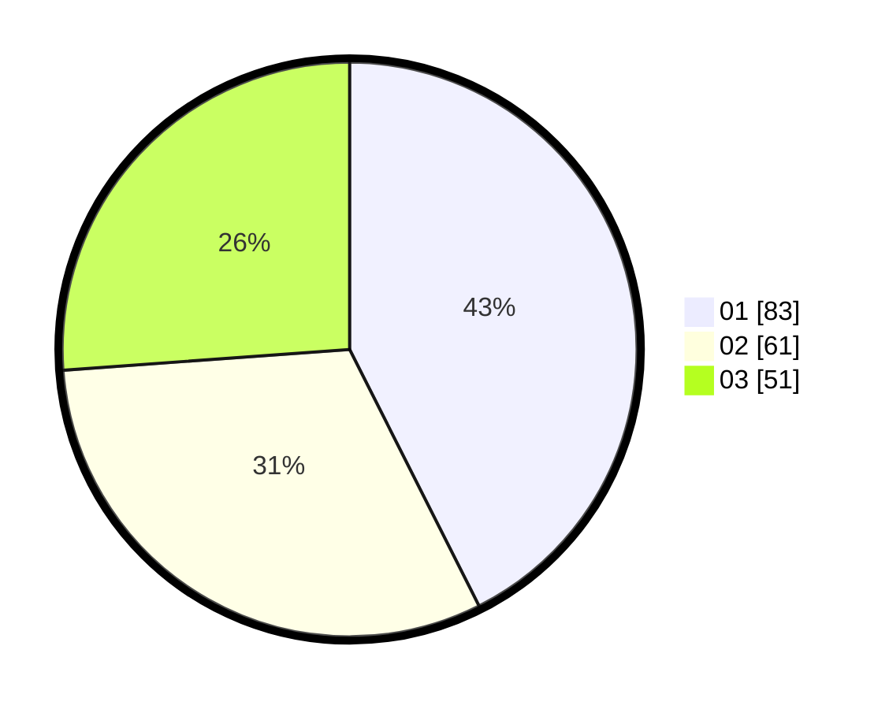

# Hasil

Hasil perolehan suara paslon dapat dilihat pada file paslon-01.txt, paslon-02.txt, dan paslon-03.txt.

Jika tidak ada, artinya data tersebut belum ada pada SIREKAP.

## Perolehan Suara

 * Paslon 01: **83**.
 * Paslon 02: **61**.
 * Paslon 03: **51**.

## Foto C Plano

https://sirekap-obj-formc.kpu.go.id/3990/pemilu/ppwp/31/73/04/10/08/3173041008018-20240214-155735--6d777e60-36ef-46e8-818a-71bcd7f5f6a1.jpg

https://sirekap-obj-formc.kpu.go.id/3990/pemilu/ppwp/31/73/04/10/08/3173041008018-20240214-155757--cdda8ffa-233e-4912-a51a-a64a267fc94d.jpg

https://sirekap-obj-formc.kpu.go.id/3990/pemilu/ppwp/31/73/04/10/08/3173041008018-20240214-160104--799c7bef-0656-4ec7-9bac-ed50edca728c.jpg

## DATA PEMILIH TETAP

Jumlah pemilih dalam DPT: **240**.
 * L: **124**.
 * P: **116**.

## DATA PENGGUNA HAK PILIH

Jumlah pengguna hak pilih dalam DPT: **193**.
 * L: **98**.
 * P: **95**.

Jumlah pengguna hak pilih dalam DPTb: **3**.
 * L: **3**.
 * P: **0**.

Jumlah pengguna hak pilih dalam DPK: **1**.
 * L: **1**.
 * P: **0**.

Jumlah pengguna hak pilih: **197**.
 * L: **102**.
 * P: **95**.

## JUMLAH SUARA SAH DAN TIDAK SAH

JUMLAH SELURUH SUARA SAH: **195**.

JUMLAH SUARA TIDAK SAH: **2**.

JUMLAH SELURUH SUARA SAH DAN SUARA TIDAK SAH: **197**.
