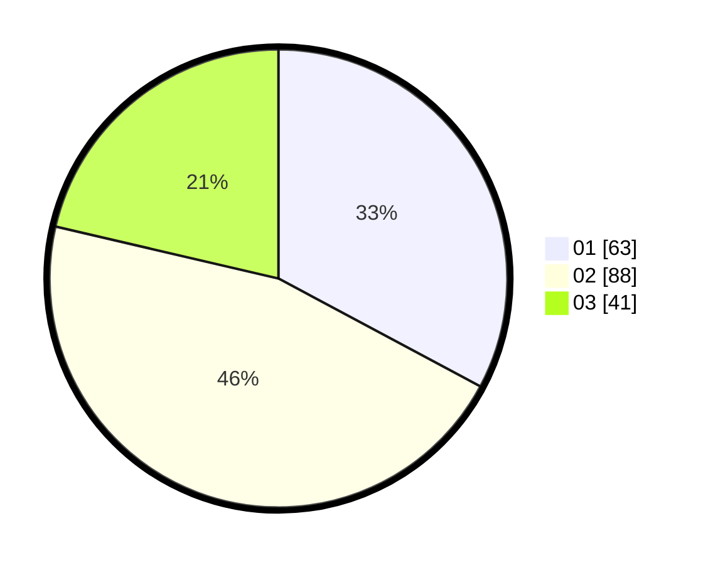

# Hasil

Hasil perolehan suara paslon dapat dilihat pada file paslon-01.txt, paslon-02.txt, dan paslon-03.txt.

Jika tidak ada, artinya data tersebut belum ada pada SIREKAP.

## Perolehan Suara

 * Paslon 01: **63**.
 * Paslon 02: **88**.
 * Paslon 03: **41**.

## Foto C Plano

https://sirekap-obj-formc.kpu.go.id/1b77/pemilu/ppwp/31/73/04/10/08/3173041008023-20240214-222504--6bc8ca8e-a5b7-4d11-b66f-ff7ecb823348.jpg

https://sirekap-obj-formc.kpu.go.id/1b77/pemilu/ppwp/31/73/04/10/08/3173041008023-20240214-222705--07ba74ab-3c70-41e9-8c9f-82a303667b91.jpg

https://sirekap-obj-formc.kpu.go.id/1b77/pemilu/ppwp/31/73/04/10/08/3173041008023-20240214-222825--18212741-3e79-46e3-8300-f7aaeee428e7.jpg
