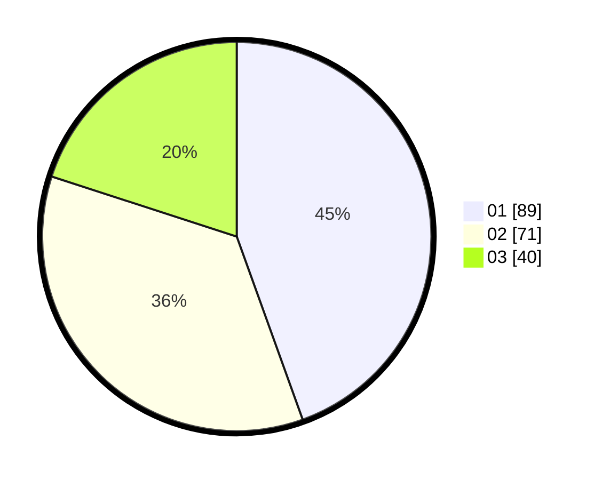

# Hasil

Hasil perolehan suara paslon dapat dilihat pada file paslon-01.txt, paslon-02.txt, dan paslon-03.txt.

Jika tidak ada, artinya data tersebut belum ada pada SIREKAP.

## Perolehan Suara

 * Paslon 01: **89**.
 * Paslon 02: **71**.
 * Paslon 03: **40**.

## Foto C Plano

https://sirekap-obj-formc.kpu.go.id/0c9f/pemilu/ppwp/31/73/04/10/08/3173041008039-20240214-231131--85be39d8-40e7-45e6-a643-b4e91555b8b4.jpg

https://sirekap-obj-formc.kpu.go.id/0c9f/pemilu/ppwp/31/73/04/10/08/3173041008039-20240214-230655--3a671814-0823-430e-8356-a07f47e16721.jpg

https://sirekap-obj-formc.kpu.go.id/0c9f/pemilu/ppwp/31/73/04/10/08/3173041008039-20240214-231923--d525a901-8131-4316-b5da-3a5fd363e9cb.jpg
