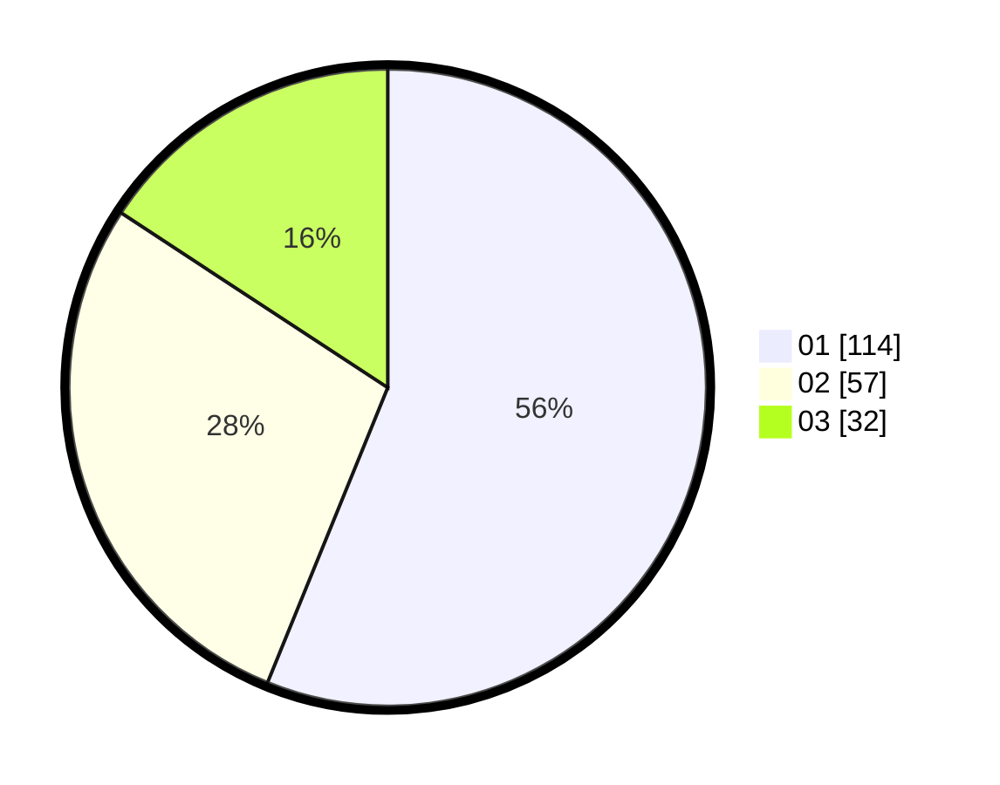

# Hasil

Hasil perolehan suara paslon dapat dilihat pada file paslon-01.txt, paslon-02.txt, dan paslon-03.txt.

Jika tidak ada, artinya data tersebut belum ada pada SIREKAP.

## Perolehan Suara

 * Paslon 01: **114**.
 * Paslon 02: **57**.
 * Paslon 03: **32**.

## Foto C Plano

https://sirekap-obj-formc.kpu.go.id/1a72/pemilu/ppwp/31/73/04/10/08/3173041008044-20240218-124819--487f2f16-a05f-4453-9636-712c6f8b1050.jpg

https://sirekap-obj-formc.kpu.go.id/1a72/pemilu/ppwp/31/73/04/10/08/3173041008044-20240218-125048--7dfd8f67-62dd-4d16-af56-37517b9ea0b4.jpg

https://sirekap-obj-formc.kpu.go.id/1a72/pemilu/ppwp/31/73/04/10/08/3173041008044-20240218-125308--d684c286-aedd-4fa5-9a00-778246c4f638.jpg
