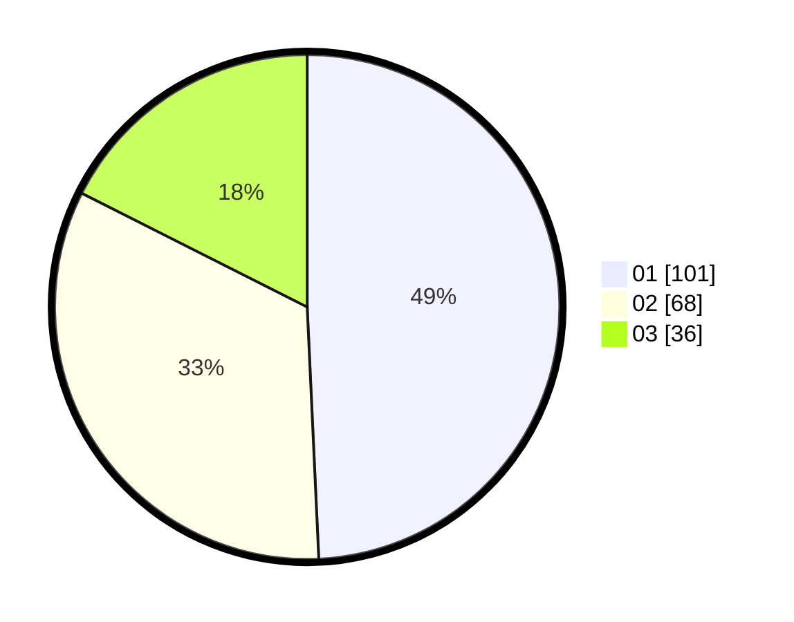

# Hasil

Hasil perolehan suara paslon dapat dilihat pada file paslon-01.txt, paslon-02.txt, dan paslon-03.txt.

Jika tidak ada, artinya data tersebut belum ada pada SIREKAP.

## Perolehan Suara

 * Paslon 01: **101**.
 * Paslon 02: **68**.
 * Paslon 03: **36**.

## Foto C Plano

https://sirekap-obj-formc.kpu.go.id/e94a/pemilu/ppwp/31/73/04/10/08/3173041008050-20240214-192032--c60235a0-1405-4767-a6e7-684ca87504b0.jpg

https://sirekap-obj-formc.kpu.go.id/e94a/pemilu/ppwp/31/73/04/10/08/3173041008050-20240214-192314--236348f0-9c35-4e93-bf41-88dabe95c345.jpg

https://sirekap-obj-formc.kpu.go.id/e94a/pemilu/ppwp/31/73/04/10/08/3173041008050-20240214-192430--9de03678-e418-4792-9025-2d77808ce9b9.jpg

## DATA PEMILIH TETAP

Jumlah pemilih dalam DPT: **285**.
 * L: **144**.
 * P: **141**.

## DATA PENGGUNA HAK PILIH

Jumlah pengguna hak pilih dalam DPT: **206**.
 * L: **103**.
 * P: **103**.

Jumlah pengguna hak pilih dalam DPTb: **1**.
 * L: **0**.
 * P: **1**.

Jumlah pengguna hak pilih dalam DPK: **1**.
 * L: **0**.
 * P: **1**.

Jumlah pengguna hak pilih: **208**.
 * L: **103**.
 * P: **105**.

## JUMLAH SUARA SAH DAN TIDAK SAH

JUMLAH SELURUH SUARA SAH: **205**.

JUMLAH SUARA TIDAK SAH: **3**.

JUMLAH SELURUH SUARA SAH DAN SUARA TIDAK SAH: **208**.
