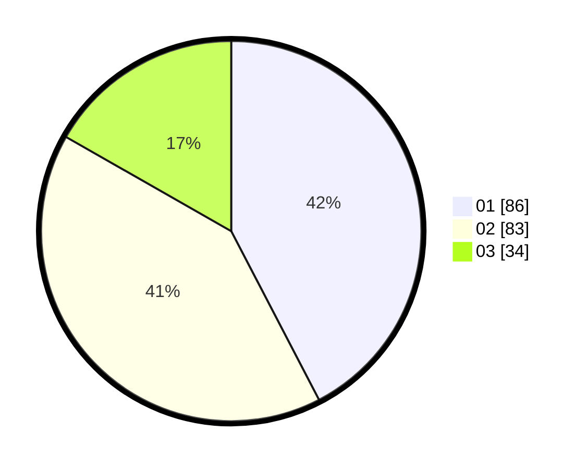

# Hasil

Hasil perolehan suara paslon dapat dilihat pada file paslon-01.txt, paslon-02.txt, dan paslon-03.txt.

Jika tidak ada, artinya data tersebut belum ada pada SIREKAP.

## Perolehan Suara

 * Paslon 01: **86**.
 * Paslon 02: **83**.
 * Paslon 03: **34**.

## Foto C Plano

https://sirekap-obj-formc.kpu.go.id/e9e9/pemilu/ppwp/31/73/04/10/08/3173041008053-20240214-220319--18bef2c3-c7e8-4b46-94f0-40f0ee898da0.jpg

https://sirekap-obj-formc.kpu.go.id/e9e9/pemilu/ppwp/31/73/04/10/08/3173041008053-20240215-002637--ac3337e0-324f-4815-a801-5ef84a67c6a9.jpg

https://sirekap-obj-formc.kpu.go.id/e9e9/pemilu/ppwp/31/73/04/10/08/3173041008053-20240215-002532--fbb2300c-39fb-4b8b-aee4-a38a600a004d.jpg
