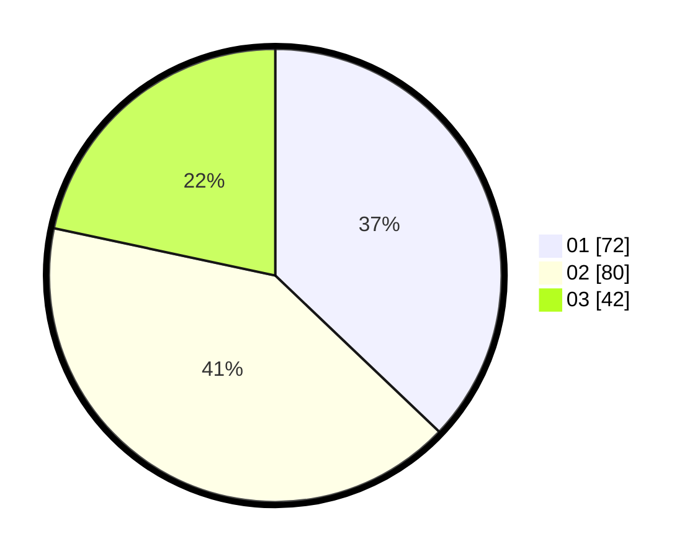

# Hasil

Hasil perolehan suara paslon dapat dilihat pada file paslon-01.txt, paslon-02.txt, dan paslon-03.txt.

Jika tidak ada, artinya data tersebut belum ada pada SIREKAP.

## Perolehan Suara

 * Paslon 01: **72**.
 * Paslon 02: **80**.
 * Paslon 03: **42**.

## Foto C Plano

https://sirekap-obj-formc.kpu.go.id/e44f/pemilu/ppwp/31/73/04/10/08/3173041008054-20240215-001233--1ecf3943-b79c-4869-aa46-225fe1ba15f0.jpg

https://sirekap-obj-formc.kpu.go.id/e44f/pemilu/ppwp/31/73/04/10/08/3173041008054-20240215-170814--7bad5b61-b1d3-44cc-828e-497a2e188d2e.jpg

https://sirekap-obj-formc.kpu.go.id/e44f/pemilu/ppwp/31/73/04/10/08/3173041008054-20240214-235346--9a40f5e6-d0ce-4178-84ed-54733e491a25.jpg

## DATA PEMILIH TETAP

Jumlah pemilih dalam DPT: **276**.
 * L: **146**.
 * P: **130**.

## DATA PENGGUNA HAK PILIH

Jumlah pengguna hak pilih dalam DPT: **199**.
 * L: **104**.
 * P: **95**.

Jumlah pengguna hak pilih dalam DPTb: **0**.
 * L: **0**.
 * P: **0**.

Jumlah pengguna hak pilih dalam DPK: **0**.
 * L: **0**.
 * P: **0**.

Jumlah pengguna hak pilih: **199**.
 * L: **104**.
 * P: **95**.

## JUMLAH SUARA SAH DAN TIDAK SAH

JUMLAH SELURUH SUARA SAH: **194**.

JUMLAH SUARA TIDAK SAH: **5**.

JUMLAH SELURUH SUARA SAH DAN SUARA TIDAK SAH: **199**.
