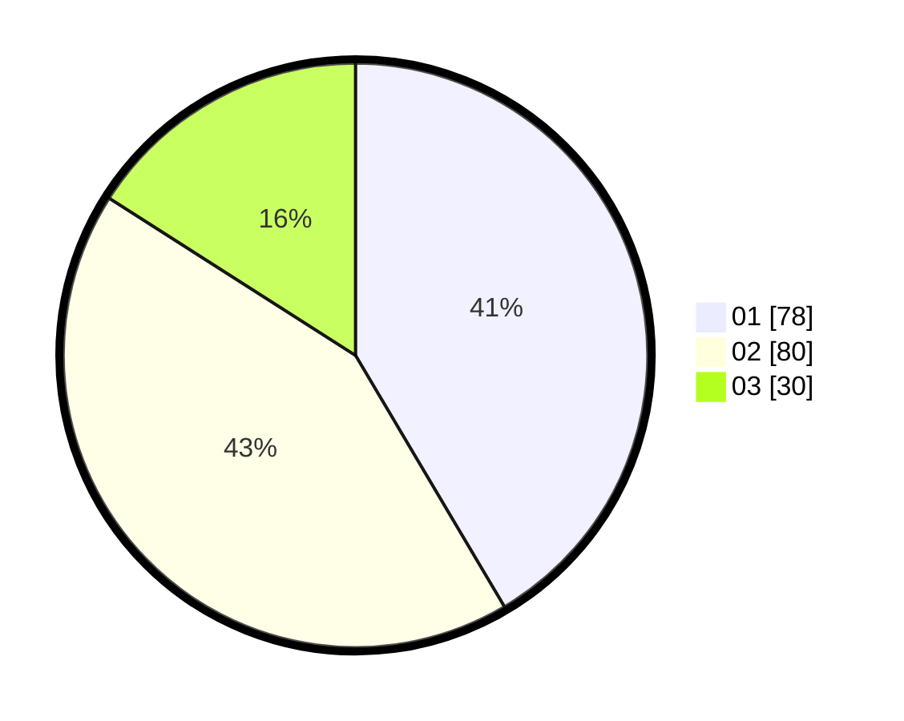

# Hasil

Hasil perolehan suara paslon dapat dilihat pada file paslon-01.txt, paslon-02.txt, dan paslon-03.txt.

Jika tidak ada, artinya data tersebut belum ada pada SIREKAP.

## Perolehan Suara

 * Paslon 01: **78**.
 * Paslon 02: **80**.
 * Paslon 03: **30**.

## Foto C Plano

https://sirekap-obj-formc.kpu.go.id/47dd/pemilu/ppwp/31/73/04/10/08/3173041008055-20240214-201507--c340e653-81ec-44ff-a895-68b612f831e5.jpg

https://sirekap-obj-formc.kpu.go.id/47dd/pemilu/ppwp/31/73/04/10/08/3173041008055-20240214-195949--01e9d846-fea9-4785-9827-d30253dbc59d.jpg

https://sirekap-obj-formc.kpu.go.id/47dd/pemilu/ppwp/31/73/04/10/08/3173041008055-20240214-195741--5f1a8d01-ecf3-465d-8002-7139ac0ff8df.jpg
