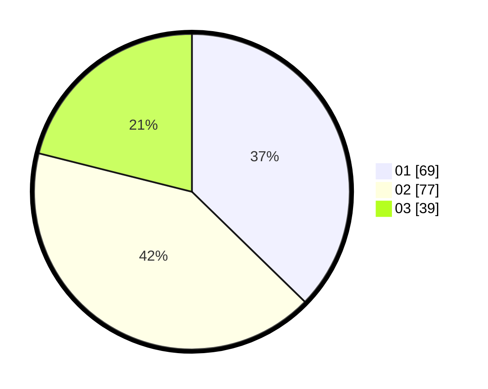

# Hasil

Hasil perolehan suara paslon dapat dilihat pada file paslon-01.txt, paslon-02.txt, dan paslon-03.txt.

Jika tidak ada, artinya data tersebut belum ada pada SIREKAP.

## Perolehan Suara

 * Paslon 01: **69**.
 * Paslon 02: **77**.
 * Paslon 03: **39**.

## Foto C Plano

https://sirekap-obj-formc.kpu.go.id/88e6/pemilu/ppwp/31/73/04/10/08/3173041008057-20240214-222919--ea40a324-941b-4323-a869-4b8db20ac9ec.jpg

https://sirekap-obj-formc.kpu.go.id/88e6/pemilu/ppwp/31/73/04/10/08/3173041008057-20240214-214118--e9fec3d8-9ee4-456a-8022-f0b8044a418b.jpg

https://sirekap-obj-formc.kpu.go.id/88e6/pemilu/ppwp/31/73/04/10/08/3173041008057-20240214-214224--cb8718c1-a599-4f72-9068-538d0cef1489.jpg
