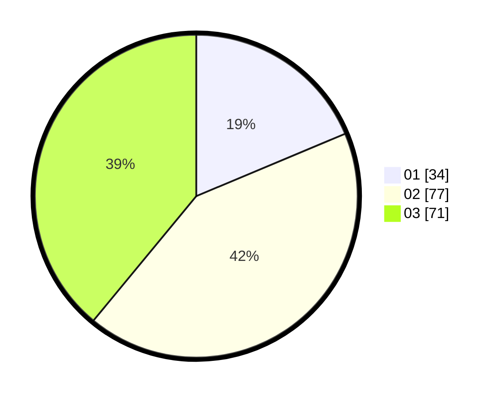

# Hasil

Hasil perolehan suara paslon dapat dilihat pada file paslon-01.txt, paslon-02.txt, dan paslon-03.txt.

Jika tidak ada, artinya data tersebut belum ada pada SIREKAP.

## Perolehan Suara

 * Paslon 01: **34**.
 * Paslon 02: **77**.
 * Paslon 03: **71**.

## Foto C Plano

https://sirekap-obj-formc.kpu.go.id/cf19/pemilu/ppwp/31/73/04/10/08/3173041008061-20240214-230857--f37f0a46-c484-412c-9bf3-91ab9a95ecd5.jpg

https://sirekap-obj-formc.kpu.go.id/cf19/pemilu/ppwp/31/73/04/10/08/3173041008061-20240214-231058--3fd7f56a-2cfb-4a0d-88bc-35cf4645945b.jpg

https://sirekap-obj-formc.kpu.go.id/cf19/pemilu/ppwp/31/73/04/10/08/3173041008061-20240214-231207--a90f2f50-b46f-47f3-b8f7-98ac0408c963.jpg
