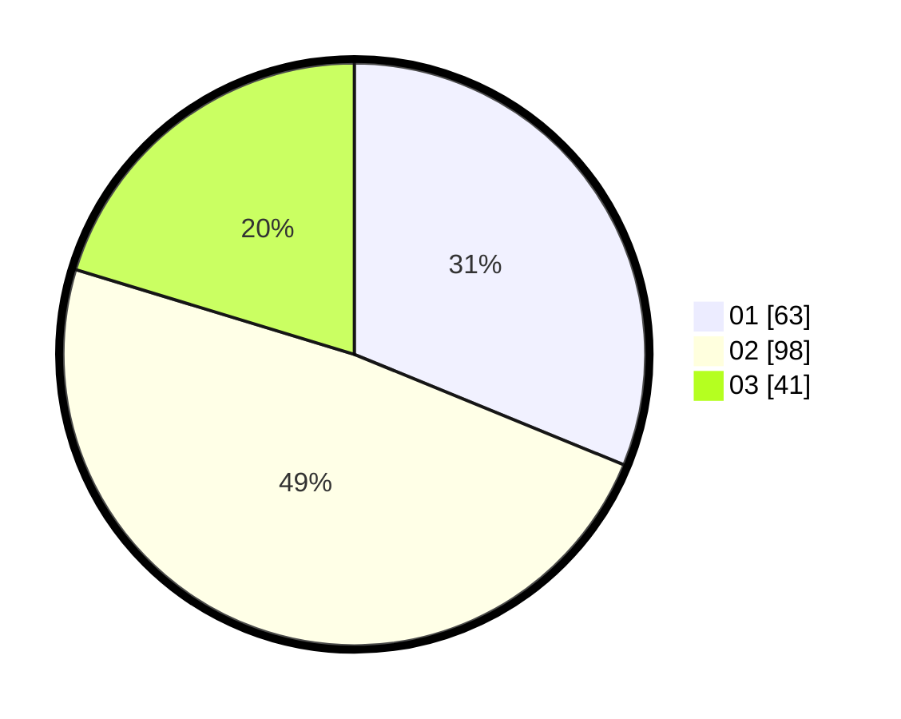

# Hasil

Hasil perolehan suara paslon dapat dilihat pada file paslon-01.txt, paslon-02.txt, dan paslon-03.txt.

Jika tidak ada, artinya data tersebut belum ada pada SIREKAP.

## Perolehan Suara

 * Paslon 01: **63**.
 * Paslon 02: **98**.
 * Paslon 03: **41**.

## Foto C Plano

https://sirekap-obj-formc.kpu.go.id/d4c9/pemilu/ppwp/31/73/04/10/08/3173041008062-20240214-155515--333381ec-310e-4650-8bde-3d6e75e7df71.jpg

https://sirekap-obj-formc.kpu.go.id/d4c9/pemilu/ppwp/31/73/04/10/08/3173041008062-20240214-155130--d8f9497f-2202-42f2-a714-b72720f5314a.jpg

https://sirekap-obj-formc.kpu.go.id/d4c9/pemilu/ppwp/31/73/04/10/08/3173041008062-20240214-155638--10f6f5d9-9042-462e-badb-508244eceb26.jpg

## DATA PEMILIH TETAP

Jumlah pemilih dalam DPT: **280**.
 * L: **137**.
 * P: **143**.

## DATA PENGGUNA HAK PILIH

Jumlah pengguna hak pilih dalam DPT: **202**.
 * L: **98**.
 * P: **104**.

Jumlah pengguna hak pilih dalam DPTb: **0**.
 * L: **0**.
 * P: **0**.

Jumlah pengguna hak pilih dalam DPK: **3**.
 * L: **2**.
 * P: **1**.

Jumlah pengguna hak pilih: **205**.
 * L: **100**.
 * P: **105**.

## JUMLAH SUARA SAH DAN TIDAK SAH

JUMLAH SELURUH SUARA SAH: **202**.

JUMLAH SUARA TIDAK SAH: **3**.

JUMLAH SELURUH SUARA SAH DAN SUARA TIDAK SAH: **205**.
