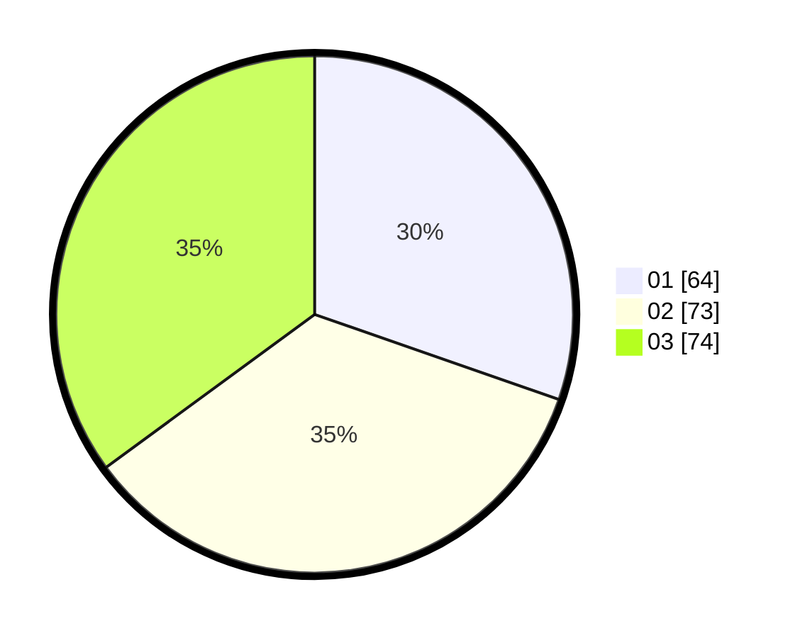

# Hasil

Hasil perolehan suara paslon dapat dilihat pada file paslon-01.txt, paslon-02.txt, dan paslon-03.txt.

Jika tidak ada, artinya data tersebut belum ada pada SIREKAP.

## Perolehan Suara

 * Paslon 01: **64**.
 * Paslon 02: **73**.
 * Paslon 03: **74**.

## Foto C Plano

https://sirekap-obj-formc.kpu.go.id/3571/pemilu/ppwp/31/73/04/10/08/3173041008063-20240214-210024--625d75ee-3eae-45e9-8a4b-70553dd3095f.jpg

https://sirekap-obj-formc.kpu.go.id/3571/pemilu/ppwp/31/73/04/10/08/3173041008063-20240214-215936--fa161eab-a50d-44ac-b369-878a7f91c284.jpg

https://sirekap-obj-formc.kpu.go.id/3571/pemilu/ppwp/31/73/04/10/08/3173041008063-20240214-203204--924ea10b-54be-4b5a-a869-fa1c8d5c0611.jpg

## DATA PEMILIH TETAP

Jumlah pemilih dalam DPT: **275**.
 * L: **148**.
 * P: **127**.

## DATA PENGGUNA HAK PILIH

Jumlah pengguna hak pilih dalam DPT: **204**.
 * L: **111**.
 * P: **93**.

Jumlah pengguna hak pilih dalam DPTb: **6**.
 * L: **4**.
 * P: **2**.

Jumlah pengguna hak pilih dalam DPK: **3**.
 * L: **1**.
 * P: **2**.

Jumlah pengguna hak pilih: **213**.
 * L: **116**.
 * P: **97**.

## JUMLAH SUARA SAH DAN TIDAK SAH

JUMLAH SELURUH SUARA SAH: **211**.

JUMLAH SUARA TIDAK SAH: **2**.

JUMLAH SELURUH SUARA SAH DAN SUARA TIDAK SAH: **213**.
