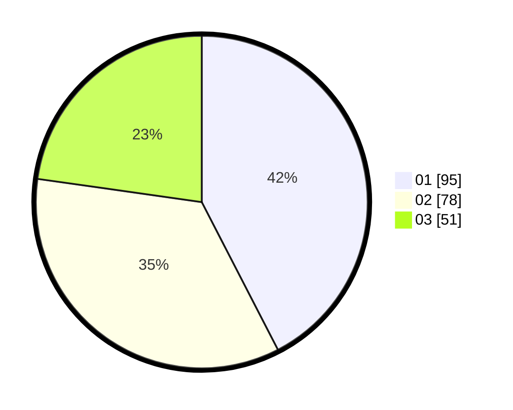

# Hasil

Hasil perolehan suara paslon dapat dilihat pada file paslon-01.txt, paslon-02.txt, dan paslon-03.txt.

Jika tidak ada, artinya data tersebut belum ada pada SIREKAP.

## Perolehan Suara

 * Paslon 01: **95**.
 * Paslon 02: **78**.
 * Paslon 03: **51**.

## Foto C Plano

https://sirekap-obj-formc.kpu.go.id/1184/pemilu/ppwp/31/73/04/10/08/3173041008068-20240214-190947--4da76971-0850-40eb-8513-cebc4499128a.jpg

https://sirekap-obj-formc.kpu.go.id/1184/pemilu/ppwp/31/73/04/10/08/3173041008068-20240214-191039--2337e9b7-af3c-4811-9008-df420ed7e6d6.jpg

https://sirekap-obj-formc.kpu.go.id/1184/pemilu/ppwp/31/73/04/10/08/3173041008068-20240214-191130--724dedf0-fb65-44ed-b2a0-cabd2c9af6a6.jpg
