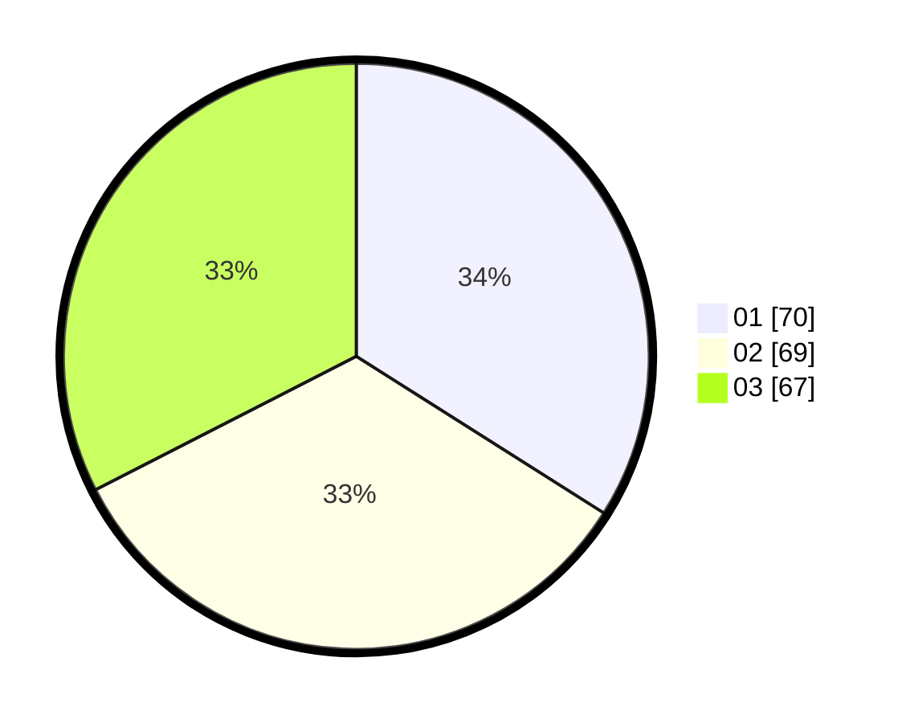

# Hasil

Hasil perolehan suara paslon dapat dilihat pada file paslon-01.txt, paslon-02.txt, dan paslon-03.txt.

Jika tidak ada, artinya data tersebut belum ada pada SIREKAP.

## Perolehan Suara

 * Paslon 01: **70**.
 * Paslon 02: **69**.
 * Paslon 03: **67**.

## Foto C Plano

https://sirekap-obj-formc.kpu.go.id/c462/pemilu/ppwp/31/73/04/10/08/3173041008071-20240214-194442--3cf40465-f116-46c7-ac65-3dd9eab7a447.jpg

https://sirekap-obj-formc.kpu.go.id/c462/pemilu/ppwp/31/73/04/10/08/3173041008071-20240214-220744--eef41f9d-aba5-4f12-a272-cdfedcbf55ca.jpg

https://sirekap-obj-formc.kpu.go.id/c462/pemilu/ppwp/31/73/04/10/08/3173041008071-20240214-194459--8796622c-1e17-4da5-af1e-5fce4f21d7fe.jpg
