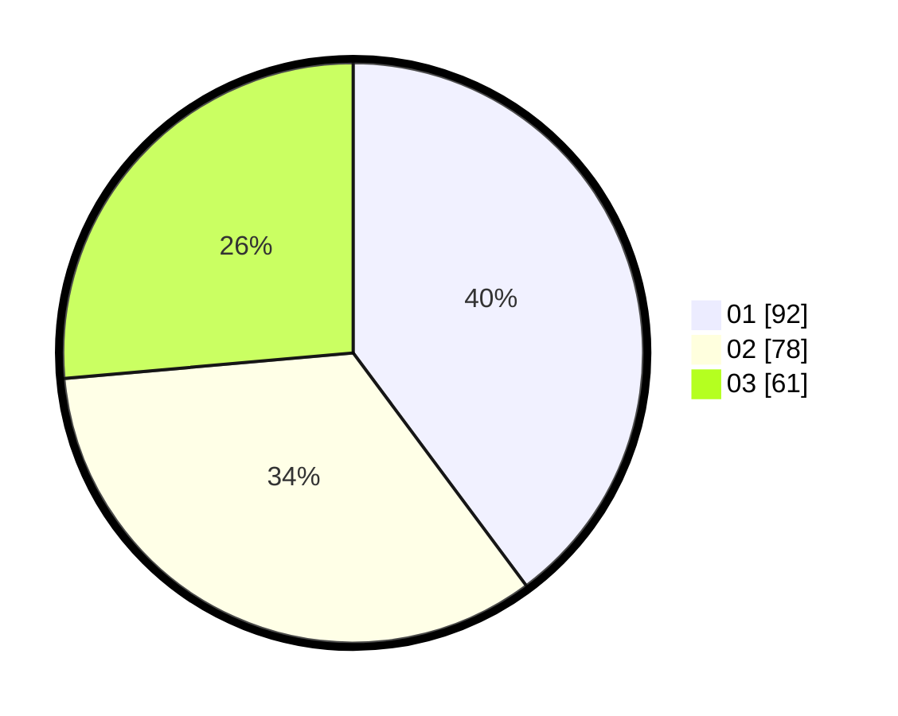

# Hasil

Hasil perolehan suara paslon dapat dilihat pada file paslon-01.txt, paslon-02.txt, dan paslon-03.txt.

Jika tidak ada, artinya data tersebut belum ada pada SIREKAP.

## Perolehan Suara

 * Paslon 01: **92**.
 * Paslon 02: **78**.
 * Paslon 03: **61**.

## Foto C Plano

https://sirekap-obj-formc.kpu.go.id/bc4a/pemilu/ppwp/31/73/04/10/09/3173041009012-20240215-001449--805b4c9d-a4a3-4adb-99ee-dc65c6b816ee.jpg

https://sirekap-obj-formc.kpu.go.id/bc4a/pemilu/ppwp/31/73/04/10/09/3173041009012-20240214-210235--919b2e5e-3050-4e10-946a-8e43fb701613.jpg

https://sirekap-obj-formc.kpu.go.id/bc4a/pemilu/ppwp/31/73/04/10/09/3173041009012-20240214-210326--9d28f64a-8c87-49e0-8c4c-aecac6ffc8c2.jpg
