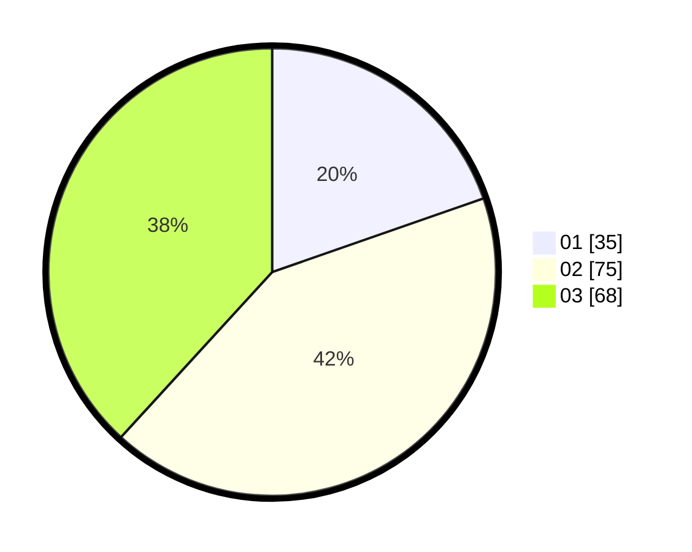

# Hasil

Hasil perolehan suara paslon dapat dilihat pada file paslon-01.txt, paslon-02.txt, dan paslon-03.txt.

Jika tidak ada, artinya data tersebut belum ada pada SIREKAP.

## Perolehan Suara

 * Paslon 01: **35**.
 * Paslon 02: **75**.
 * Paslon 03: **68**.

## Foto C Plano

https://sirekap-obj-formc.kpu.go.id/ecb5/pemilu/ppwp/31/73/04/10/09/3173041009014-20240214-190415--0d2bf6ad-c8bf-4988-8e3a-8398bcda1278.jpg

https://sirekap-obj-formc.kpu.go.id/ecb5/pemilu/ppwp/31/73/04/10/09/3173041009014-20240214-190517--67508962-96c1-46dc-b62d-d294f0de9479.jpg

https://sirekap-obj-formc.kpu.go.id/ecb5/pemilu/ppwp/31/73/04/10/09/3173041009014-20240214-190527--6081283c-0054-4c7b-b441-92cbf13b0c21.jpg

## DATA PEMILIH TETAP

Jumlah pemilih dalam DPT: **246**.
 * L: **128**.
 * P: **118**.

## DATA PENGGUNA HAK PILIH

Jumlah pengguna hak pilih dalam DPT: **182**.
 * L: **94**.
 * P: **88**.

Jumlah pengguna hak pilih dalam DPTb: **0**.
 * L: **0**.
 * P: **0**.

Jumlah pengguna hak pilih dalam DPK: **0**.
 * L: **0**.
 * P: **0**.

Jumlah pengguna hak pilih: **182**.
 * L: **94**.
 * P: **88**.

## JUMLAH SUARA SAH DAN TIDAK SAH

JUMLAH SELURUH SUARA SAH: **178**.

JUMLAH SUARA TIDAK SAH: **4**.

JUMLAH SELURUH SUARA SAH DAN SUARA TIDAK SAH: **182**.
