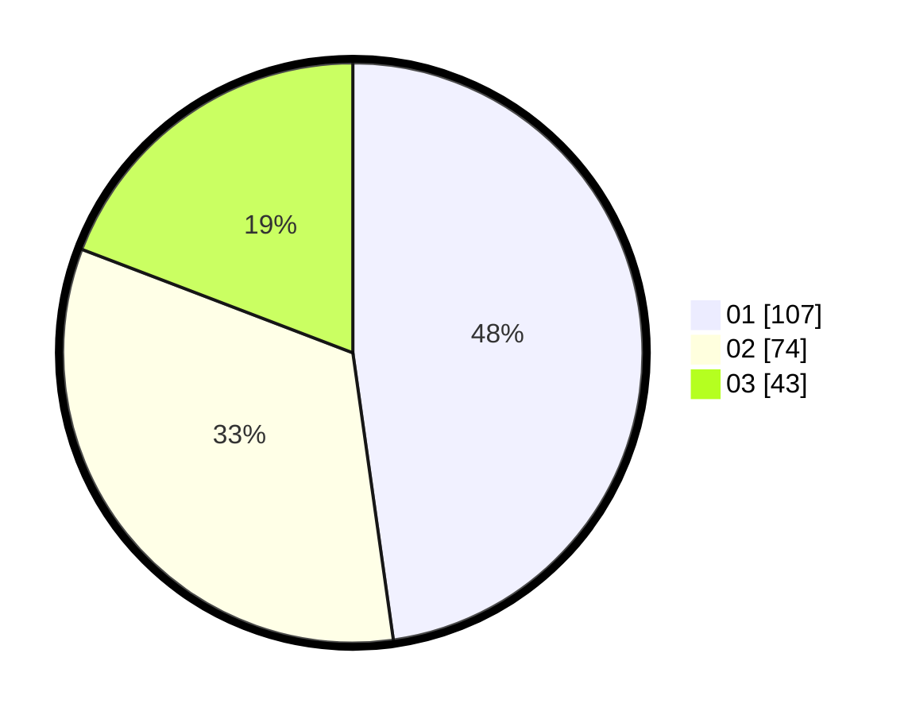

# Hasil

Hasil perolehan suara paslon dapat dilihat pada file paslon-01.txt, paslon-02.txt, dan paslon-03.txt.

Jika tidak ada, artinya data tersebut belum ada pada SIREKAP.

## Perolehan Suara

 * Paslon 01: **107**.
 * Paslon 02: **74**.
 * Paslon 03: **43**.

## Foto C Plano

https://sirekap-obj-formc.kpu.go.id/b98a/pemilu/ppwp/31/73/04/10/09/3173041009018-20240215-000709--5c5e7717-6116-4ccc-9279-c2e3d145e775.jpg

https://sirekap-obj-formc.kpu.go.id/b98a/pemilu/ppwp/31/73/04/10/09/3173041009018-20240215-000830--7d8bf8e9-5600-4c83-8f5e-08ab164fb2d9.jpg

https://sirekap-obj-formc.kpu.go.id/b98a/pemilu/ppwp/31/73/04/10/09/3173041009018-20240215-000938--54711769-8a1e-4df0-b49f-b2bdc4a3b1ee.jpg
