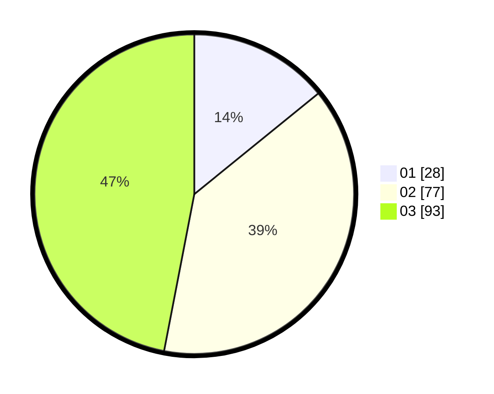

# Hasil

Hasil perolehan suara paslon dapat dilihat pada file paslon-01.txt, paslon-02.txt, dan paslon-03.txt.

Jika tidak ada, artinya data tersebut belum ada pada SIREKAP.

## Perolehan Suara

 * Paslon 01: **28**.
 * Paslon 02: **77**.
 * Paslon 03: **93**.

## Foto C Plano

https://sirekap-obj-formc.kpu.go.id/1fbb/pemilu/ppwp/31/73/04/10/09/3173041009020-20240214-204110--24c6b35e-4af7-4871-9aab-22e74d8fa176.jpg

https://sirekap-obj-formc.kpu.go.id/1fbb/pemilu/ppwp/31/73/04/10/09/3173041009020-20240214-191834--4efe1a73-91f4-486f-8a62-a403ae67a849.jpg

https://sirekap-obj-formc.kpu.go.id/1fbb/pemilu/ppwp/31/73/04/10/09/3173041009020-20240214-191816--58d083a4-4955-4b22-b561-1d4ed22961cb.jpg

## DATA PEMILIH TETAP

Jumlah pemilih dalam DPT: **275**.
 * L: **124**.
 * P: **151**.

## DATA PENGGUNA HAK PILIH

Jumlah pengguna hak pilih dalam DPT: **197**.
 * L: **93**.
 * P: **104**.

Jumlah pengguna hak pilih dalam DPTb: **0**.
 * L: **0**.
 * P: **0**.

Jumlah pengguna hak pilih dalam DPK: **2**.
 * L: **2**.
 * P: **0**.

Jumlah pengguna hak pilih: **199**.
 * L: **95**.
 * P: **104**.

## JUMLAH SUARA SAH DAN TIDAK SAH

JUMLAH SELURUH SUARA SAH: **198**.

JUMLAH SUARA TIDAK SAH: **1**.

JUMLAH SELURUH SUARA SAH DAN SUARA TIDAK SAH: **199**.
