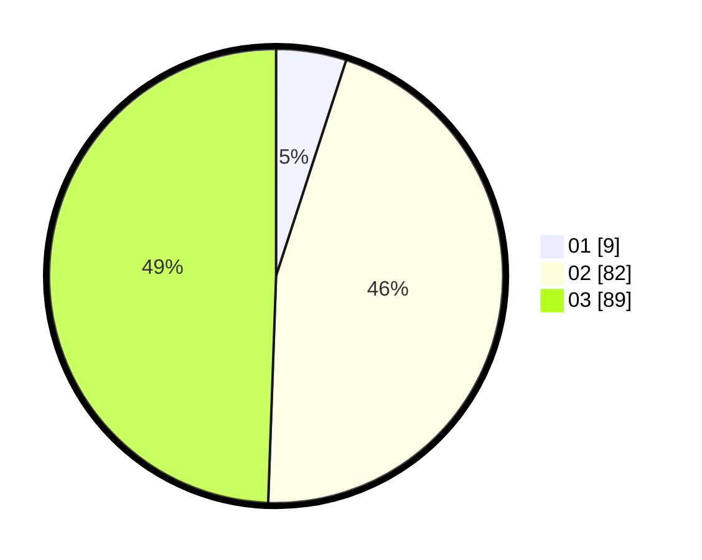

# Hasil

Hasil perolehan suara paslon dapat dilihat pada file paslon-01.txt, paslon-02.txt, dan paslon-03.txt.

Jika tidak ada, artinya data tersebut belum ada pada SIREKAP.

## Perolehan Suara

 * Paslon 01: **9**.
 * Paslon 02: **82**.
 * Paslon 03: **89**.

## Foto C Plano

https://sirekap-obj-formc.kpu.go.id/f547/pemilu/ppwp/31/73/04/10/09/3173041009021-20240215-000055--4220ce07-f3d6-44bb-bd84-7a239abb7c82.jpg

https://sirekap-obj-formc.kpu.go.id/f547/pemilu/ppwp/31/73/04/10/09/3173041009021-20240215-000106--34146ea9-9df9-4feb-96c9-c5194d2c38c6.jpg

https://sirekap-obj-formc.kpu.go.id/f547/pemilu/ppwp/31/73/04/10/09/3173041009021-20240215-000115--f6187128-b2b7-43f8-a7d4-0d4b5d1bd290.jpg
