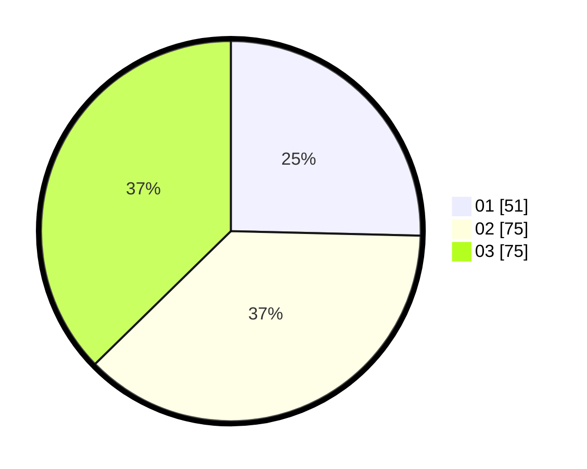

# Hasil

Hasil perolehan suara paslon dapat dilihat pada file paslon-01.txt, paslon-02.txt, dan paslon-03.txt.

Jika tidak ada, artinya data tersebut belum ada pada SIREKAP.

## Perolehan Suara

 * Paslon 01: **51**.
 * Paslon 02: **75**.
 * Paslon 03: **75**.

## Foto C Plano

https://sirekap-obj-formc.kpu.go.id/b9cd/pemilu/ppwp/31/73/04/10/09/3173041009026-20240214-185619--3a07b16a-d587-45ae-ae85-f23d8ab438c4.jpg

https://sirekap-obj-formc.kpu.go.id/b9cd/pemilu/ppwp/31/73/04/10/09/3173041009026-20240215-005559--88cc7074-9ac7-41c1-9afd-a3fb721de9a4.jpg

https://sirekap-obj-formc.kpu.go.id/b9cd/pemilu/ppwp/31/73/04/10/09/3173041009026-20240215-005810--0c164cc0-6b69-44ab-b1ce-1dc02549e822.jpg

## DATA PEMILIH TETAP

Jumlah pemilih dalam DPT: **268**.
 * L: **140**.
 * P: **128**.

## DATA PENGGUNA HAK PILIH

Jumlah pengguna hak pilih dalam DPT: **204**.
 * L: **108**.
 * P: **96**.

Jumlah pengguna hak pilih dalam DPTb: **0**.
 * L: **0**.
 * P: **0**.

Jumlah pengguna hak pilih dalam DPK: **3**.
 * L: **1**.
 * P: **2**.

Jumlah pengguna hak pilih: **207**.
 * L: **109**.
 * P: **98**.

## JUMLAH SUARA SAH DAN TIDAK SAH

JUMLAH SELURUH SUARA SAH: **201**.

JUMLAH SUARA TIDAK SAH: **6**.

JUMLAH SELURUH SUARA SAH DAN SUARA TIDAK SAH: **207**.
