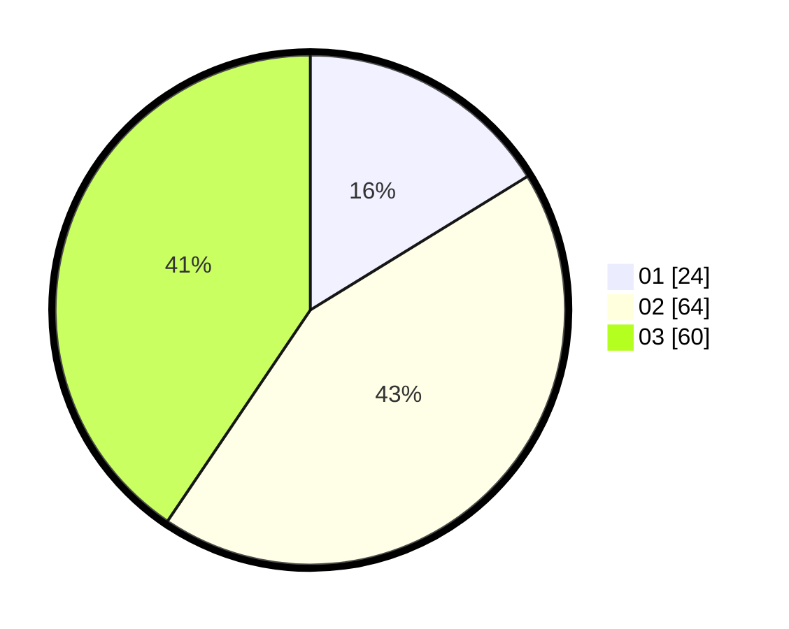

# Hasil

Hasil perolehan suara paslon dapat dilihat pada file paslon-01.txt, paslon-02.txt, dan paslon-03.txt.

Jika tidak ada, artinya data tersebut belum ada pada SIREKAP.

## Perolehan Suara

 * Paslon 01: **24**.
 * Paslon 02: **64**.
 * Paslon 03: **60**.

## Foto C Plano

https://sirekap-obj-formc.kpu.go.id/6d73/pemilu/ppwp/31/73/04/10/09/3173041009029-20240214-235406--adc02232-34f1-4af1-85ab-81bb400414df.jpg

https://sirekap-obj-formc.kpu.go.id/6d73/pemilu/ppwp/31/73/04/10/09/3173041009029-20240214-235546--8fc2573e-c83e-49cd-a679-234e170d8395.jpg

https://sirekap-obj-formc.kpu.go.id/6d73/pemilu/ppwp/31/73/04/10/09/3173041009029-20240214-235900--9a6ce63a-eb21-45e7-bdc2-c498d78bfecb.jpg
