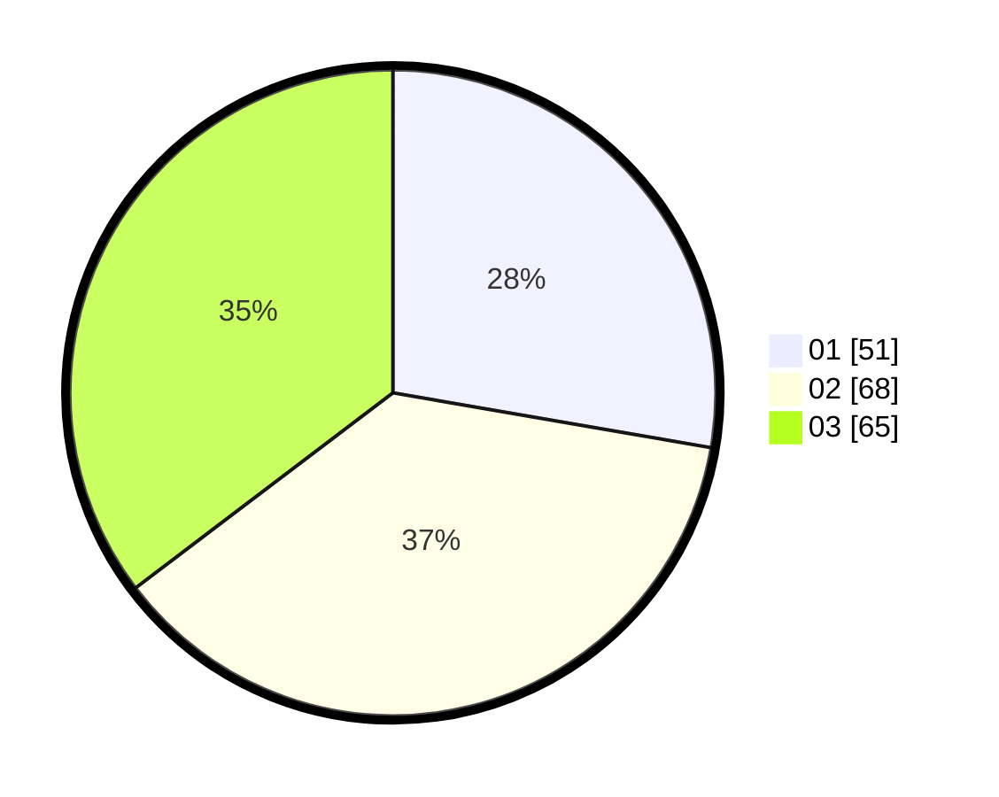

# Hasil

Hasil perolehan suara paslon dapat dilihat pada file paslon-01.txt, paslon-02.txt, dan paslon-03.txt.

Jika tidak ada, artinya data tersebut belum ada pada SIREKAP.

## Perolehan Suara

 * Paslon 01: **51**.
 * Paslon 02: **68**.
 * Paslon 03: **65**.

## Foto C Plano

https://sirekap-obj-formc.kpu.go.id/4dab/pemilu/ppwp/31/73/04/10/09/3173041009030-20240215-025440--2565c63e-bf84-4f79-ac6b-4082d56900ba.jpg

https://sirekap-obj-formc.kpu.go.id/4dab/pemilu/ppwp/31/73/04/10/09/3173041009030-20240215-025920--b245e46c-9f16-4644-8e93-8f4ee1c96006.jpg

https://sirekap-obj-formc.kpu.go.id/4dab/pemilu/ppwp/31/73/04/10/09/3173041009030-20240215-023635--b2cdab62-05da-4aca-81d8-3e46829f9e19.jpg
