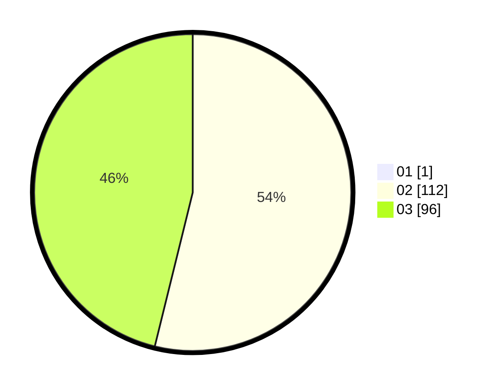

# Hasil

Hasil perolehan suara paslon dapat dilihat pada file paslon-01.txt, paslon-02.txt, dan paslon-03.txt.

Jika tidak ada, artinya data tersebut belum ada pada SIREKAP.

## Perolehan Suara

 * Paslon 01: **1**.
 * Paslon 02: **112**.
 * Paslon 03: **96**.

## Foto C Plano

https://sirekap-obj-formc.kpu.go.id/f712/pemilu/ppwp/31/73/04/10/09/3173041009035-20240214-200403--8ab0191b-48d5-43d8-b547-dc5d9ae840fa.jpg

https://sirekap-obj-formc.kpu.go.id/f712/pemilu/ppwp/31/73/04/10/09/3173041009035-20240214-200507--819bceb0-7d19-45d0-b22c-a90435361a4b.jpg

https://sirekap-obj-formc.kpu.go.id/f712/pemilu/ppwp/31/73/04/10/09/3173041009035-20240214-200555--83f75eff-c20c-4d87-86a9-dd30cab427a9.jpg

## DATA PEMILIH TETAP

Jumlah pemilih dalam DPT: **287**.
 * L: **136**.
 * P: **151**.

## DATA PENGGUNA HAK PILIH

Jumlah pengguna hak pilih dalam DPT: **211**.
 * L: **101**.
 * P: **110**.

Jumlah pengguna hak pilih dalam DPTb: **0**.
 * L: **0**.
 * P: **0**.

Jumlah pengguna hak pilih dalam DPK: **1**.
 * L: **1**.
 * P: **0**.

Jumlah pengguna hak pilih: **212**.
 * L: **102**.
 * P: **110**.

## JUMLAH SUARA SAH DAN TIDAK SAH

JUMLAH SELURUH SUARA SAH: **209**.

JUMLAH SUARA TIDAK SAH: **3**.

JUMLAH SELURUH SUARA SAH DAN SUARA TIDAK SAH: **212**.
