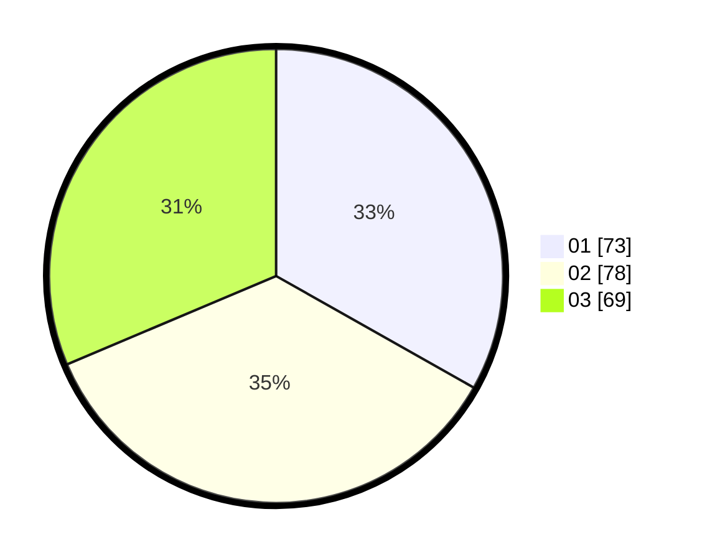

# Hasil

Hasil perolehan suara paslon dapat dilihat pada file paslon-01.txt, paslon-02.txt, dan paslon-03.txt.

Jika tidak ada, artinya data tersebut belum ada pada SIREKAP.

## Perolehan Suara

 * Paslon 01: **73**.
 * Paslon 02: **78**.
 * Paslon 03: **69**.

## Foto C Plano

https://sirekap-obj-formc.kpu.go.id/c2ad/pemilu/ppwp/31/73/04/10/09/3173041009036-20240216-082909--b6212d79-4afe-4703-8c23-89cfb464942b.jpg

https://sirekap-obj-formc.kpu.go.id/c2ad/pemilu/ppwp/31/73/04/10/09/3173041009036-20240216-082918--5256c511-d619-4002-a363-170b817d2db5.jpg

https://sirekap-obj-formc.kpu.go.id/c2ad/pemilu/ppwp/31/73/04/10/09/3173041009036-20240216-082916--c3e0b3cc-4bd0-447d-a902-67bd488b7dfb.jpg

## DATA PEMILIH TETAP

Jumlah pemilih dalam DPT: **280**.
 * L: **136**.
 * P: **144**.

## DATA PENGGUNA HAK PILIH

Jumlah pengguna hak pilih dalam DPT: **215**.
 * L: **101**.
 * P: **114**.

Jumlah pengguna hak pilih dalam DPTb: **6**.
 * L: **3**.
 * P: **3**.

Jumlah pengguna hak pilih dalam DPK: **2**.
 * L: **2**.
 * P: **0**.

Jumlah pengguna hak pilih: **223**.
 * L: **106**.
 * P: **117**.

## JUMLAH SUARA SAH DAN TIDAK SAH

JUMLAH SELURUH SUARA SAH: **220**.

JUMLAH SUARA TIDAK SAH: **3**.

JUMLAH SELURUH SUARA SAH DAN SUARA TIDAK SAH: **223**.
