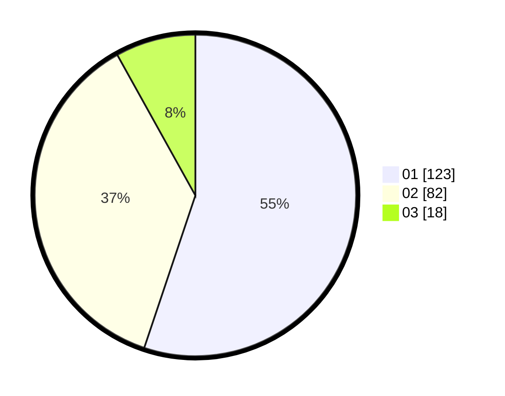

# Hasil

Hasil perolehan suara paslon dapat dilihat pada file paslon-01.txt, paslon-02.txt, dan paslon-03.txt.

Jika tidak ada, artinya data tersebut belum ada pada SIREKAP.

## Perolehan Suara

 * Paslon 01: **123**.
 * Paslon 02: **82**.
 * Paslon 03: **18**.

## Foto C Plano

https://sirekap-obj-formc.kpu.go.id/f678/pemilu/ppwp/31/73/04/10/09/3173041009037-20240215-020933--47311053-9d00-413a-992b-e6fcbbd03da5.jpg

https://sirekap-obj-formc.kpu.go.id/f678/pemilu/ppwp/31/73/04/10/09/3173041009037-20240215-021041--5d0d14ee-ef1d-489d-ac7a-7963146e5771.jpg

https://sirekap-obj-formc.kpu.go.id/f678/pemilu/ppwp/31/73/04/10/09/3173041009037-20240215-021157--751f6f08-4626-41fd-af5e-7eadac7af22e.jpg
