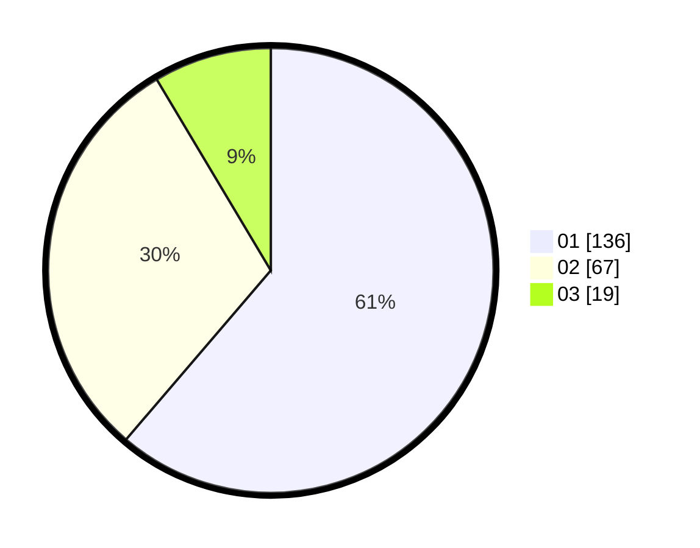

# Hasil

Hasil perolehan suara paslon dapat dilihat pada file paslon-01.txt, paslon-02.txt, dan paslon-03.txt.

Jika tidak ada, artinya data tersebut belum ada pada SIREKAP.

## Perolehan Suara

 * Paslon 01: **136**.
 * Paslon 02: **67**.
 * Paslon 03: **19**.

## Foto C Plano

https://sirekap-obj-formc.kpu.go.id/41fd/pemilu/ppwp/31/73/04/10/09/3173041009039-20240215-020020--f4bc6476-4bc1-4239-9496-6d3d8209d66d.jpg

https://sirekap-obj-formc.kpu.go.id/41fd/pemilu/ppwp/31/73/04/10/09/3173041009039-20240215-020251--4ab478ca-f7e8-452b-8720-d37a38816f5a.jpg

https://sirekap-obj-formc.kpu.go.id/41fd/pemilu/ppwp/31/73/04/10/09/3173041009039-20240215-020417--5de121b6-bd73-4b11-972e-c6c2b7fbe85d.jpg
