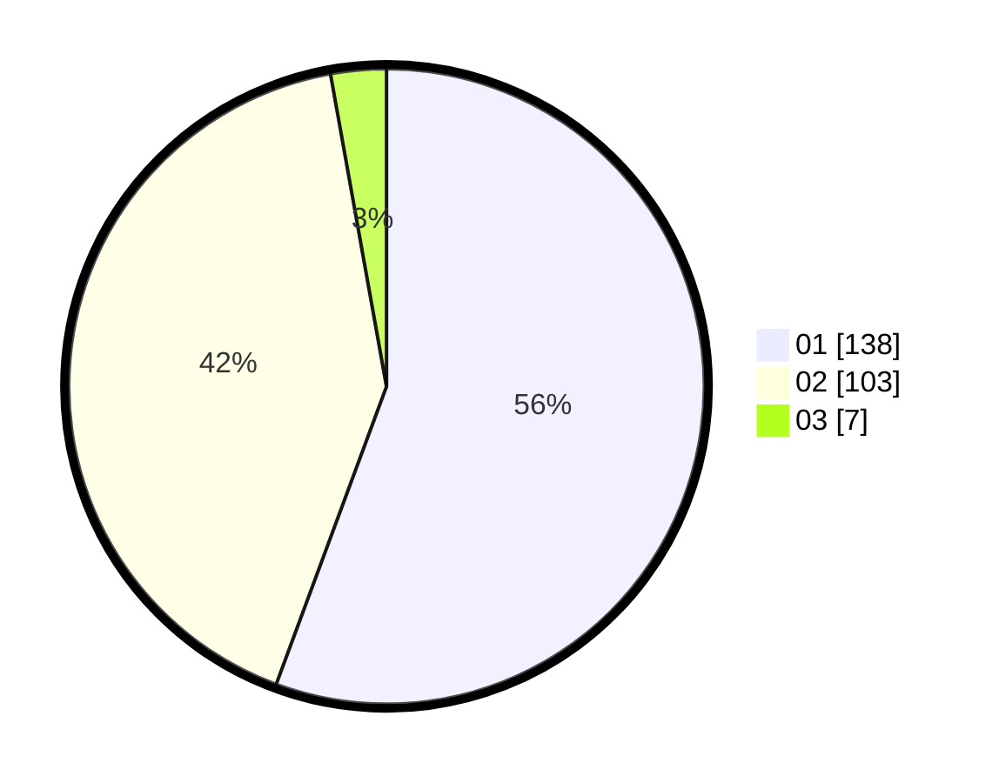

# Hasil

Hasil perolehan suara paslon dapat dilihat pada file paslon-01.txt, paslon-02.txt, dan paslon-03.txt.

Jika tidak ada, artinya data tersebut belum ada pada SIREKAP.

## Perolehan Suara

 * Paslon 01: **138**.
 * Paslon 02: **103**.
 * Paslon 03: **7**.

## Foto C Plano

https://sirekap-obj-formc.kpu.go.id/0193/pemilu/ppwp/31/73/04/10/09/3173041009043-20240215-010619--3e8a4b7a-d8a4-4168-9c01-38643be190fc.jpg

https://sirekap-obj-formc.kpu.go.id/0193/pemilu/ppwp/31/73/04/10/09/3173041009043-20240215-010858--e87b4f9c-d313-4f75-a4ce-376634d91357.jpg

https://sirekap-obj-formc.kpu.go.id/0193/pemilu/ppwp/31/73/04/10/09/3173041009043-20240215-011218--c27851ca-5f76-4b88-b50c-782ff6711f15.jpg
