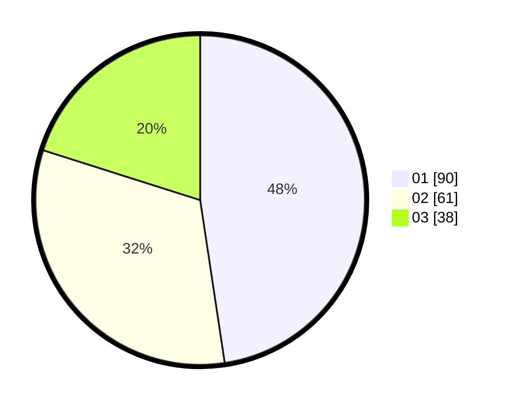

# Hasil

Hasil perolehan suara paslon dapat dilihat pada file paslon-01.txt, paslon-02.txt, dan paslon-03.txt.

Jika tidak ada, artinya data tersebut belum ada pada SIREKAP.

## Perolehan Suara

 * Paslon 01: **90**.
 * Paslon 02: **61**.
 * Paslon 03: **38**.

## Foto C Plano

https://sirekap-obj-formc.kpu.go.id/014a/pemilu/ppwp/31/73/04/10/09/3173041009046-20240214-184948--0344e413-14f0-4583-8272-d6847e9edb56.jpg

https://sirekap-obj-formc.kpu.go.id/014a/pemilu/ppwp/31/73/04/10/09/3173041009046-20240215-002301--2b2ae1e5-9fa9-4494-80e2-3d5ce7cac60a.jpg

https://sirekap-obj-formc.kpu.go.id/014a/pemilu/ppwp/31/73/04/10/09/3173041009046-20240214-232431--732b00bd-56fd-4709-a079-0f2c7223f9d9.jpg

## DATA PEMILIH TETAP

Jumlah pemilih dalam DPT: **280**.
 * L: **142**.
 * P: **138**.

## DATA PENGGUNA HAK PILIH

Jumlah pengguna hak pilih dalam DPT: **198**.
 * L: **98**.
 * P: **100**.

Jumlah pengguna hak pilih dalam DPTb: **1**.
 * L: **0**.
 * P: **1**.

Jumlah pengguna hak pilih dalam DPK: **1**.
 * L: **0**.
 * P: **1**.

Jumlah pengguna hak pilih: **200**.
 * L: **98**.
 * P: **102**.

## JUMLAH SUARA SAH DAN TIDAK SAH

JUMLAH SELURUH SUARA SAH: **189**.

JUMLAH SUARA TIDAK SAH: **11**.

JUMLAH SELURUH SUARA SAH DAN SUARA TIDAK SAH: **200**.
