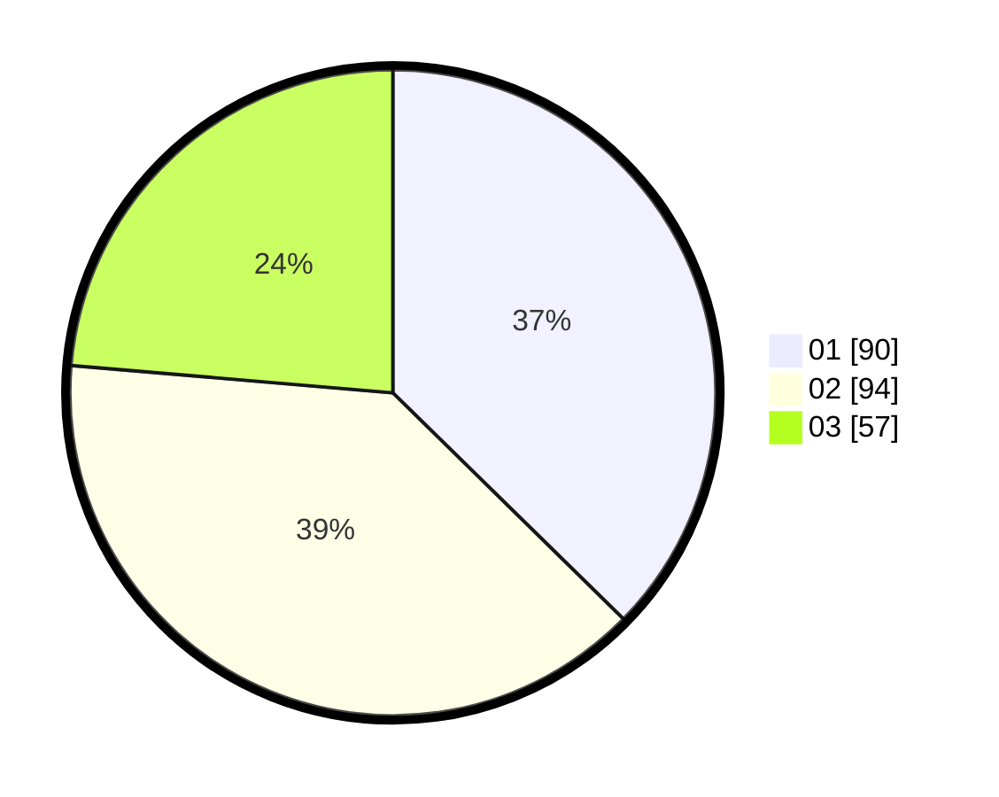

# Hasil

Hasil perolehan suara paslon dapat dilihat pada file paslon-01.txt, paslon-02.txt, dan paslon-03.txt.

Jika tidak ada, artinya data tersebut belum ada pada SIREKAP.

## Perolehan Suara

 * Paslon 01: **90**.
 * Paslon 02: **94**.
 * Paslon 03: **57**.

## Foto C Plano

https://sirekap-obj-formc.kpu.go.id/2d34/pemilu/ppwp/31/73/04/10/09/3173041009048-20240214-233657--416edcef-1730-49a4-bb4d-a9724f66e013.jpg

https://sirekap-obj-formc.kpu.go.id/2d34/pemilu/ppwp/31/73/04/10/09/3173041009048-20240214-233953--35311d54-9046-4f00-a80a-b92a72b918cb.jpg

https://sirekap-obj-formc.kpu.go.id/2d34/pemilu/ppwp/31/73/04/10/09/3173041009048-20240214-234039--edf7e012-6110-4cf9-9516-07872adce8e1.jpg

## DATA PEMILIH TETAP

Jumlah pemilih dalam DPT: **275**.
 * L: **141**.
 * P: **134**.

## DATA PENGGUNA HAK PILIH

Jumlah pengguna hak pilih dalam DPT: **238**.
 * L: **121**.
 * P: **117**.

Jumlah pengguna hak pilih dalam DPTb: **5**.
 * L: **4**.
 * P: **1**.

Jumlah pengguna hak pilih dalam DPK: **0**.
 * L: **0**.
 * P: **0**.

Jumlah pengguna hak pilih: **243**.
 * L: **125**.
 * P: **118**.

## JUMLAH SUARA SAH DAN TIDAK SAH

JUMLAH SELURUH SUARA SAH: **241**.

JUMLAH SUARA TIDAK SAH: **4**.

JUMLAH SELURUH SUARA SAH DAN SUARA TIDAK SAH: **245**.
