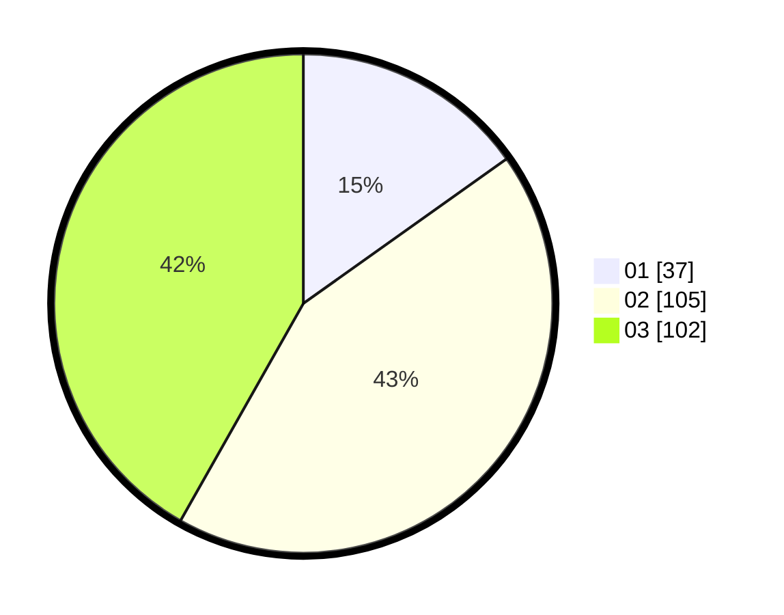

# Hasil

Hasil perolehan suara paslon dapat dilihat pada file paslon-01.txt, paslon-02.txt, dan paslon-03.txt.

Jika tidak ada, artinya data tersebut belum ada pada SIREKAP.

## Perolehan Suara

 * Paslon 01: **37**.
 * Paslon 02: **105**.
 * Paslon 03: **102**.

## Foto C Plano

https://sirekap-obj-formc.kpu.go.id/d450/pemilu/ppwp/31/73/04/10/09/3173041009049-20240214-213839--f4b54fa3-8241-4916-8386-9393dc35a983.jpg

https://sirekap-obj-formc.kpu.go.id/d450/pemilu/ppwp/31/73/04/10/09/3173041009049-20240214-214607--d4031a7e-de5e-4ebd-ac75-cddb806aed79.jpg

https://sirekap-obj-formc.kpu.go.id/d450/pemilu/ppwp/31/73/04/10/09/3173041009049-20240214-214201--df2ff687-3bc1-4e79-b707-9c192867fe7d.jpg

## DATA PEMILIH TETAP

Jumlah pemilih dalam DPT: **261**.
 * L: **119**.
 * P: **142**.

## DATA PENGGUNA HAK PILIH

Jumlah pengguna hak pilih dalam DPT: **244**.
 * L: **115**.
 * P: **129**.

Jumlah pengguna hak pilih dalam DPTb: **0**.
 * L: **0**.
 * P: **0**.

Jumlah pengguna hak pilih dalam DPK: **6**.
 * L: **3**.
 * P: **3**.

Jumlah pengguna hak pilih: **250**.
 * L: **118**.
 * P: **132**.

## JUMLAH SUARA SAH DAN TIDAK SAH

JUMLAH SELURUH SUARA SAH: **244**.

JUMLAH SUARA TIDAK SAH: **6**.

JUMLAH SELURUH SUARA SAH DAN SUARA TIDAK SAH: **250**.
