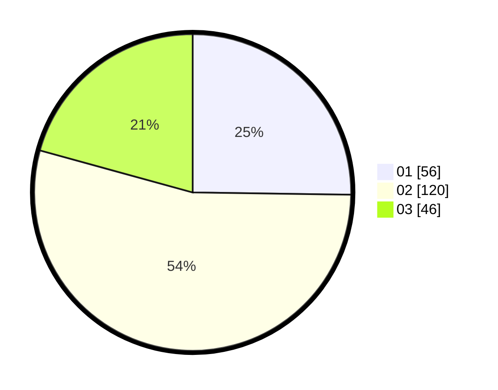

# Hasil

Hasil perolehan suara paslon dapat dilihat pada file paslon-01.txt, paslon-02.txt, dan paslon-03.txt.

Jika tidak ada, artinya data tersebut belum ada pada SIREKAP.

## Perolehan Suara

 * Paslon 01: **56**.
 * Paslon 02: **120**.
 * Paslon 03: **46**.

## Foto C Plano

https://sirekap-obj-formc.kpu.go.id/3d47/pemilu/ppwp/31/73/04/10/09/3173041009051-20240214-160132--9e696e39-b235-495e-939c-308f0aae9bb9.jpg

https://sirekap-obj-formc.kpu.go.id/3d47/pemilu/ppwp/31/73/04/10/09/3173041009051-20240215-214026--2d946e52-f93a-4eae-9eb0-0750fae5211d.jpg

https://sirekap-obj-formc.kpu.go.id/3d47/pemilu/ppwp/31/73/04/10/09/3173041009051-20240214-155444--f0dfe4a6-87c6-491c-98cc-30c761113dd4.jpg
