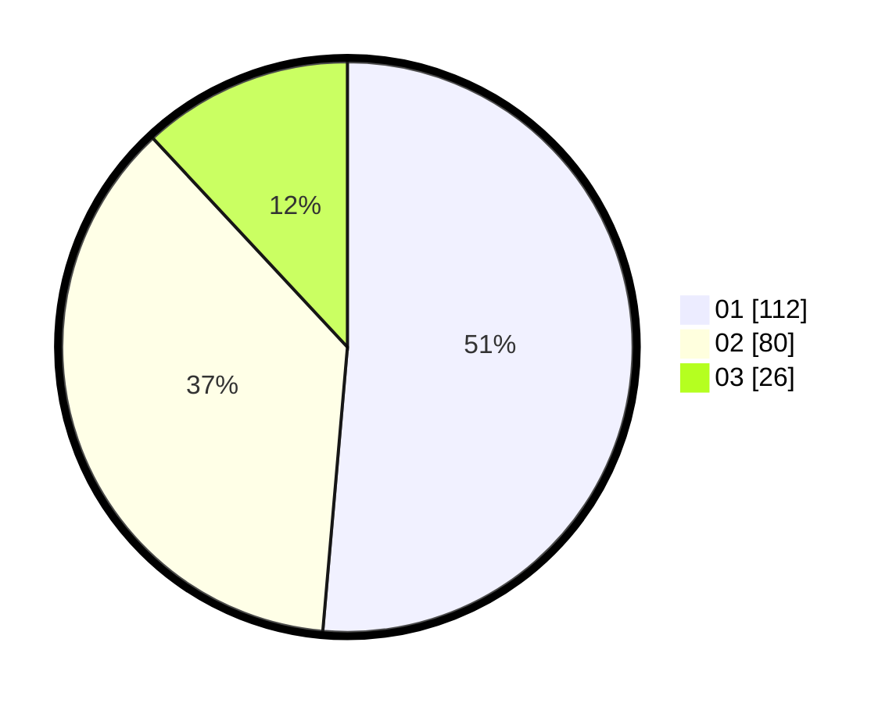

# Hasil

Hasil perolehan suara paslon dapat dilihat pada file paslon-01.txt, paslon-02.txt, dan paslon-03.txt.

Jika tidak ada, artinya data tersebut belum ada pada SIREKAP.

## Perolehan Suara

 * Paslon 01: **112**.
 * Paslon 02: **80**.
 * Paslon 03: **26**.

## Foto C Plano

https://sirekap-obj-formc.kpu.go.id/b971/pemilu/ppwp/31/73/04/10/09/3173041009053-20240214-155802--2bcbce12-1d30-4cef-aef8-83270488d9d3.jpg

https://sirekap-obj-formc.kpu.go.id/b971/pemilu/ppwp/31/73/04/10/09/3173041009053-20240214-195306--e8e0659b-5ccf-42ad-bb97-27cd8ca3041a.jpg

https://sirekap-obj-formc.kpu.go.id/b971/pemilu/ppwp/31/73/04/10/09/3173041009053-20240214-160151--aff2c1be-f95a-44cf-9b1f-9101a9126799.jpg

## DATA PEMILIH TETAP

Jumlah pemilih dalam DPT: **264**.
 * L: **144**.
 * P: **120**.

## DATA PENGGUNA HAK PILIH

Jumlah pengguna hak pilih dalam DPT: **233**.
 * L: **126**.
 * P: **107**.

Jumlah pengguna hak pilih dalam DPTb: **0**.
 * L: **0**.
 * P: **0**.

Jumlah pengguna hak pilih dalam DPK: **0**.
 * L: **0**.
 * P: **0**.

Jumlah pengguna hak pilih: **233**.
 * L: **126**.
 * P: **107**.

## JUMLAH SUARA SAH DAN TIDAK SAH

JUMLAH SELURUH SUARA SAH: **218**.

JUMLAH SUARA TIDAK SAH: **15**.

JUMLAH SELURUH SUARA SAH DAN SUARA TIDAK SAH: **233**.
