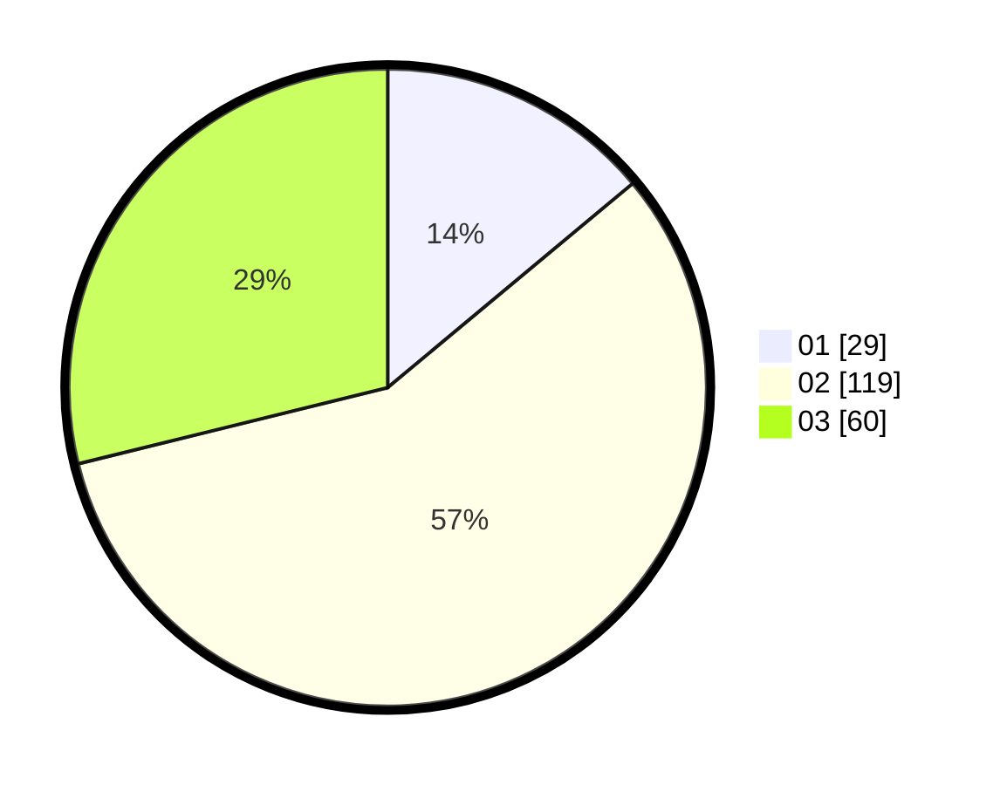

# Hasil

Hasil perolehan suara paslon dapat dilihat pada file paslon-01.txt, paslon-02.txt, dan paslon-03.txt.

Jika tidak ada, artinya data tersebut belum ada pada SIREKAP.

## Perolehan Suara

 * Paslon 01: **29**.
 * Paslon 02: **119**.
 * Paslon 03: **60**.

## Foto C Plano

https://sirekap-obj-formc.kpu.go.id/07f3/pemilu/ppwp/31/73/04/10/09/3173041009058-20240214-234552--94c1b9de-e0f4-452c-9700-c6f4d065ae5f.jpg

https://sirekap-obj-formc.kpu.go.id/07f3/pemilu/ppwp/31/73/04/10/09/3173041009058-20240214-234826--d336c0eb-0350-4002-b020-8c90c38b8228.jpg

https://sirekap-obj-formc.kpu.go.id/07f3/pemilu/ppwp/31/73/04/10/09/3173041009058-20240214-235029--b472f0a0-883e-4302-8d8e-0b1b763c7c43.jpg
