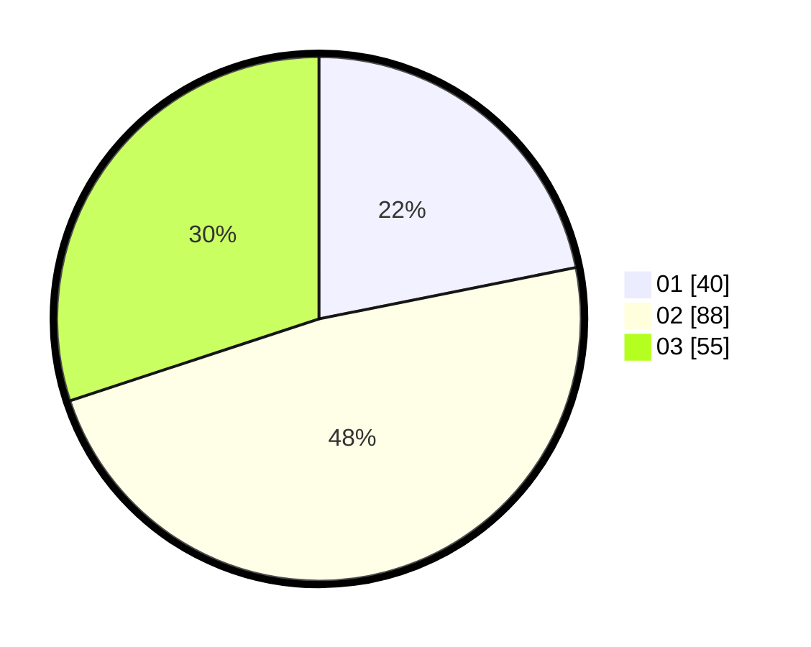

# Hasil

Hasil perolehan suara paslon dapat dilihat pada file paslon-01.txt, paslon-02.txt, dan paslon-03.txt.

Jika tidak ada, artinya data tersebut belum ada pada SIREKAP.

## Perolehan Suara

 * Paslon 01: **40**.
 * Paslon 02: **88**.
 * Paslon 03: **55**.

## Foto C Plano

https://sirekap-obj-formc.kpu.go.id/c04f/pemilu/ppwp/31/73/04/10/09/3173041009061-20240214-220033--6092f766-6fa6-4456-89c6-0d3e8b4ffe0b.jpg

https://sirekap-obj-formc.kpu.go.id/c04f/pemilu/ppwp/31/73/04/10/09/3173041009061-20240214-200358--20b8768a-de19-431b-aead-57c545f37a49.jpg

https://sirekap-obj-formc.kpu.go.id/c04f/pemilu/ppwp/31/73/04/10/09/3173041009061-20240214-200551--f46b0f66-44e2-4700-a122-391d48a96e26.jpg
