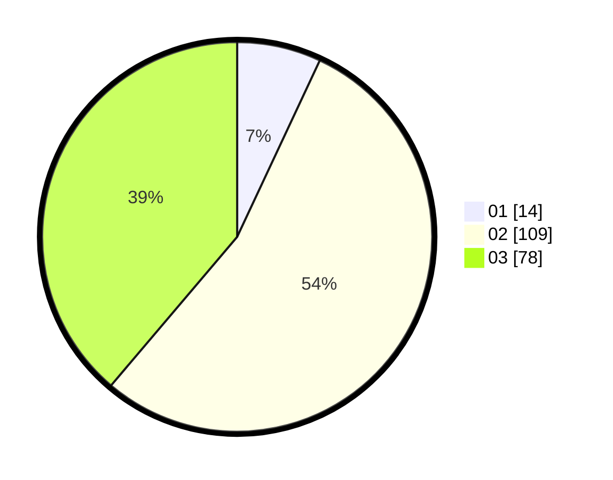

# Hasil

Hasil perolehan suara paslon dapat dilihat pada file paslon-01.txt, paslon-02.txt, dan paslon-03.txt.

Jika tidak ada, artinya data tersebut belum ada pada SIREKAP.

## Perolehan Suara

 * Paslon 01: **14**.
 * Paslon 02: **109**.
 * Paslon 03: **78**.

## Foto C Plano

https://sirekap-obj-formc.kpu.go.id/6115/pemilu/ppwp/31/73/04/10/09/3173041009062-20240214-223309--f4bb8d32-665e-42fc-bac8-db317f422106.jpg

https://sirekap-obj-formc.kpu.go.id/6115/pemilu/ppwp/31/73/04/10/09/3173041009062-20240214-223215--bc0d3bca-85ee-4e76-8bcc-d956d3555b84.jpg

https://sirekap-obj-formc.kpu.go.id/6115/pemilu/ppwp/31/73/04/10/09/3173041009062-20240214-223346--7562ae11-2243-48b0-9b87-341d53052e59.jpg
