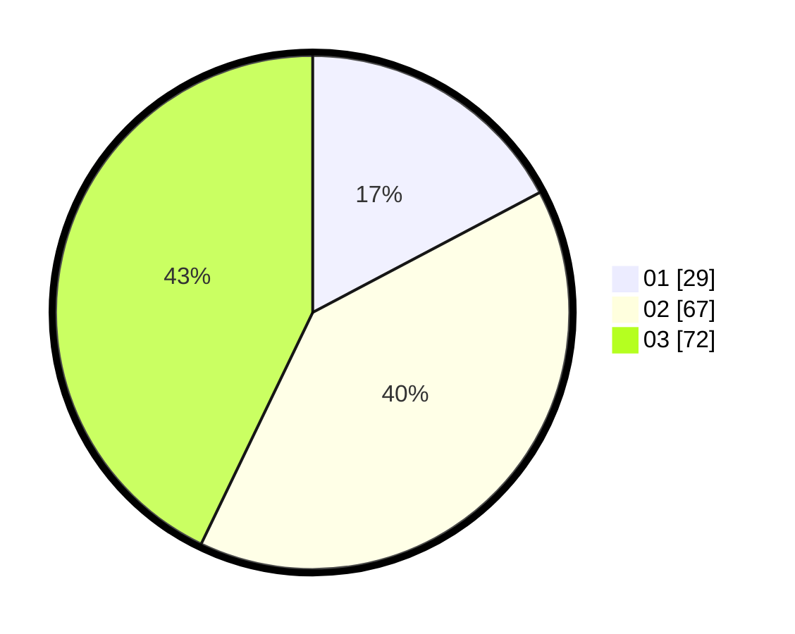

# Hasil

Hasil perolehan suara paslon dapat dilihat pada file paslon-01.txt, paslon-02.txt, dan paslon-03.txt.

Jika tidak ada, artinya data tersebut belum ada pada SIREKAP.

## Perolehan Suara

 * Paslon 01: **29**.
 * Paslon 02: **67**.
 * Paslon 03: **72**.

## Foto C Plano

https://sirekap-obj-formc.kpu.go.id/93e2/pemilu/ppwp/31/73/04/10/09/3173041009063-20240215-004152--776bf5af-a560-429f-a5fd-428ab49802ae.jpg

https://sirekap-obj-formc.kpu.go.id/93e2/pemilu/ppwp/31/73/04/10/09/3173041009063-20240215-004349--0e3c7906-3f12-4a2b-8951-4f307aca74eb.jpg

https://sirekap-obj-formc.kpu.go.id/93e2/pemilu/ppwp/31/73/04/10/09/3173041009063-20240215-004446--83fe7a72-8a9e-42a1-a370-8a6ac6bc14ff.jpg
