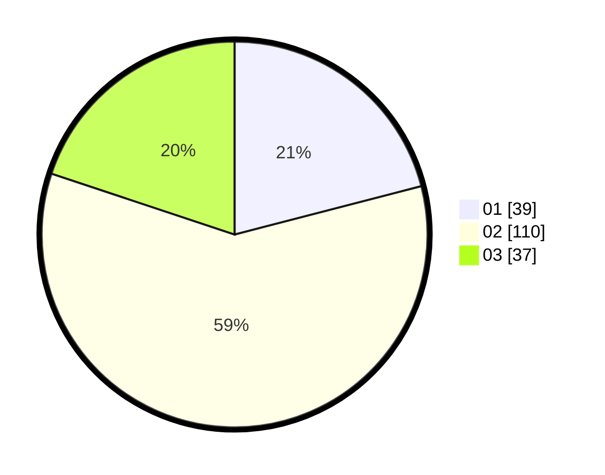

# Hasil

Hasil perolehan suara paslon dapat dilihat pada file paslon-01.txt, paslon-02.txt, dan paslon-03.txt.

Jika tidak ada, artinya data tersebut belum ada pada SIREKAP.

## Perolehan Suara

 * Paslon 01: **39**.
 * Paslon 02: **110**.
 * Paslon 03: **37**.

## Foto C Plano

https://sirekap-obj-formc.kpu.go.id/5934/pemilu/ppwp/31/73/04/10/09/3173041009066-20240215-022813--7b9d483e-a958-4932-b716-2eed281363f2.jpg

https://sirekap-obj-formc.kpu.go.id/5934/pemilu/ppwp/31/73/04/10/09/3173041009066-20240215-023123--0d482272-add9-432e-b838-86d51aa7d1d2.jpg

https://sirekap-obj-formc.kpu.go.id/5934/pemilu/ppwp/31/73/04/10/09/3173041009066-20240215-023356--3b63b1c2-a2fe-4234-bf94-6d22391ed0fc.jpg

## DATA PEMILIH TETAP

Jumlah pemilih dalam DPT: **235**.
 * L: **112**.
 * P: **123**.

## DATA PENGGUNA HAK PILIH

Jumlah pengguna hak pilih dalam DPT: **189**.
 * L: **100**.
 * P: **89**.

Jumlah pengguna hak pilih dalam DPTb: **4**.
 * L: **1**.
 * P: **3**.

Jumlah pengguna hak pilih dalam DPK: **1**.
 * L: **1**.
 * P: **0**.

Jumlah pengguna hak pilih: **194**.
 * L: **102**.
 * P: **92**.

## JUMLAH SUARA SAH DAN TIDAK SAH

JUMLAH SELURUH SUARA SAH: **186**.

JUMLAH SUARA TIDAK SAH: **8**.

JUMLAH SELURUH SUARA SAH DAN SUARA TIDAK SAH: **194**.
