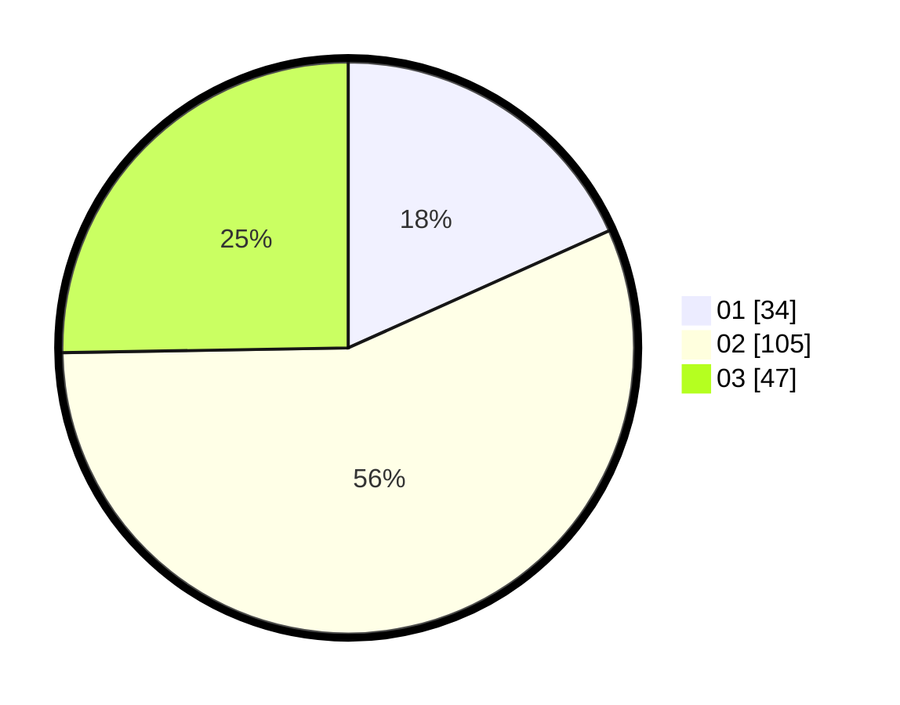

# Hasil

Hasil perolehan suara paslon dapat dilihat pada file paslon-01.txt, paslon-02.txt, dan paslon-03.txt.

Jika tidak ada, artinya data tersebut belum ada pada SIREKAP.

## Perolehan Suara

 * Paslon 01: **34**.
 * Paslon 02: **105**.
 * Paslon 03: **47**.

## Foto C Plano

https://sirekap-obj-formc.kpu.go.id/5756/pemilu/ppwp/31/73/04/10/09/3173041009067-20240215-010103--9c556282-90f8-4d26-8b5b-a5ec0263cd07.jpg

https://sirekap-obj-formc.kpu.go.id/5756/pemilu/ppwp/31/73/04/10/09/3173041009067-20240215-011228--e0aa4569-f536-4504-82b7-6c2bec0ab1e7.jpg

https://sirekap-obj-formc.kpu.go.id/5756/pemilu/ppwp/31/73/04/10/09/3173041009067-20240215-010309--6a7305cf-d961-4110-8bea-8599576137e4.jpg
