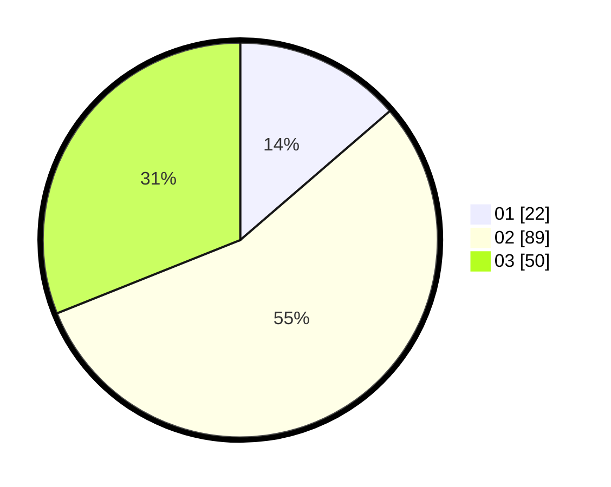

# Hasil

Hasil perolehan suara paslon dapat dilihat pada file paslon-01.txt, paslon-02.txt, dan paslon-03.txt.

Jika tidak ada, artinya data tersebut belum ada pada SIREKAP.

## Perolehan Suara

 * Paslon 01: **22**.
 * Paslon 02: **89**.
 * Paslon 03: **50**.

## Foto C Plano

https://sirekap-obj-formc.kpu.go.id/3f28/pemilu/ppwp/31/73/04/10/09/3173041009069-20240214-190847--83e3b2f6-8936-43be-adb4-5b4a2c0c847f.jpg

https://sirekap-obj-formc.kpu.go.id/3f28/pemilu/ppwp/31/73/04/10/09/3173041009069-20240214-192224--81f5b5cc-2f52-43cf-abc2-6b0beec960e6.jpg

https://sirekap-obj-formc.kpu.go.id/3f28/pemilu/ppwp/31/73/04/10/09/3173041009069-20240214-191153--97fc6988-a1d8-4910-baad-d97e8700b754.jpg

## DATA PEMILIH TETAP

Jumlah pemilih dalam DPT: **162**.
 * L: **74**.
 * P: **88**.

## DATA PENGGUNA HAK PILIH

Jumlah pengguna hak pilih dalam DPT: **154**.
 * L: **69**.
 * P: **85**.

Jumlah pengguna hak pilih dalam DPTb: **7**.
 * L: **4**.
 * P: **3**.

Jumlah pengguna hak pilih dalam DPK: **1**.
 * L: **1**.
 * P: **0**.

Jumlah pengguna hak pilih: **162**.
 * L: **74**.
 * P: **88**.

## JUMLAH SUARA SAH DAN TIDAK SAH

JUMLAH SELURUH SUARA SAH: **161**.

JUMLAH SUARA TIDAK SAH: **1**.

JUMLAH SELURUH SUARA SAH DAN SUARA TIDAK SAH: **162**.
