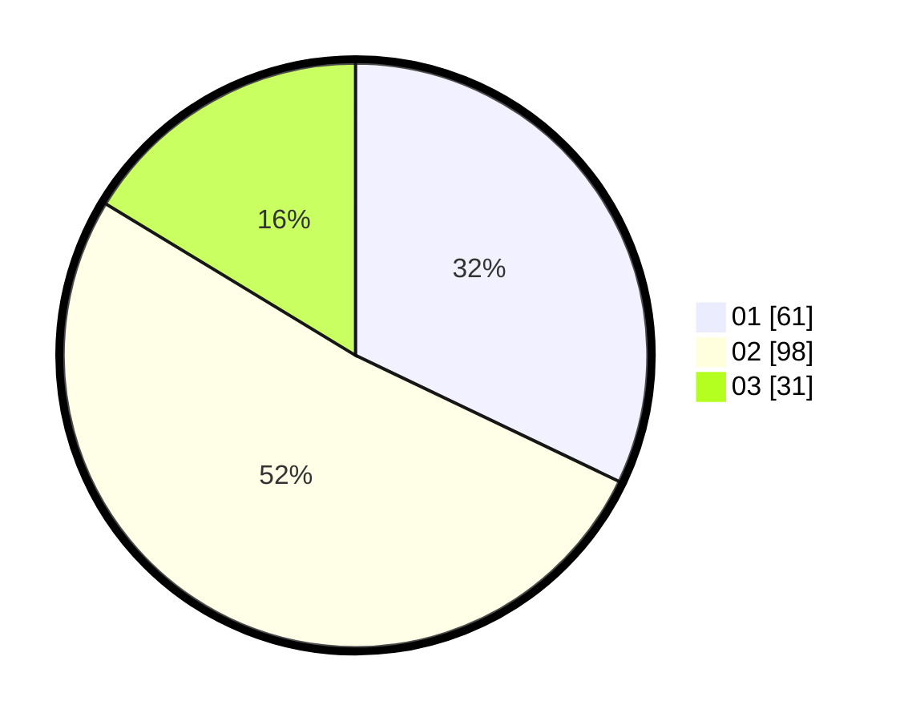

# Hasil

Hasil perolehan suara paslon dapat dilihat pada file paslon-01.txt, paslon-02.txt, dan paslon-03.txt.

Jika tidak ada, artinya data tersebut belum ada pada SIREKAP.

## Perolehan Suara

 * Paslon 01: **61**.
 * Paslon 02: **98**.
 * Paslon 03: **31**.

## Foto C Plano

https://sirekap-obj-formc.kpu.go.id/f4cc/pemilu/ppwp/31/73/04/10/09/3173041009072-20240215-024628--ea7f0929-a446-46d4-9007-7ff9c0b962a9.jpg

https://sirekap-obj-formc.kpu.go.id/f4cc/pemilu/ppwp/31/73/04/10/09/3173041009072-20240214-223132--5a7e4143-cf56-40f5-ac67-6d063ff8a98d.jpg

https://sirekap-obj-formc.kpu.go.id/f4cc/pemilu/ppwp/31/73/04/10/09/3173041009072-20240214-225204--cecc2eeb-cbed-4dce-a0c3-cfe43c64278b.jpg
