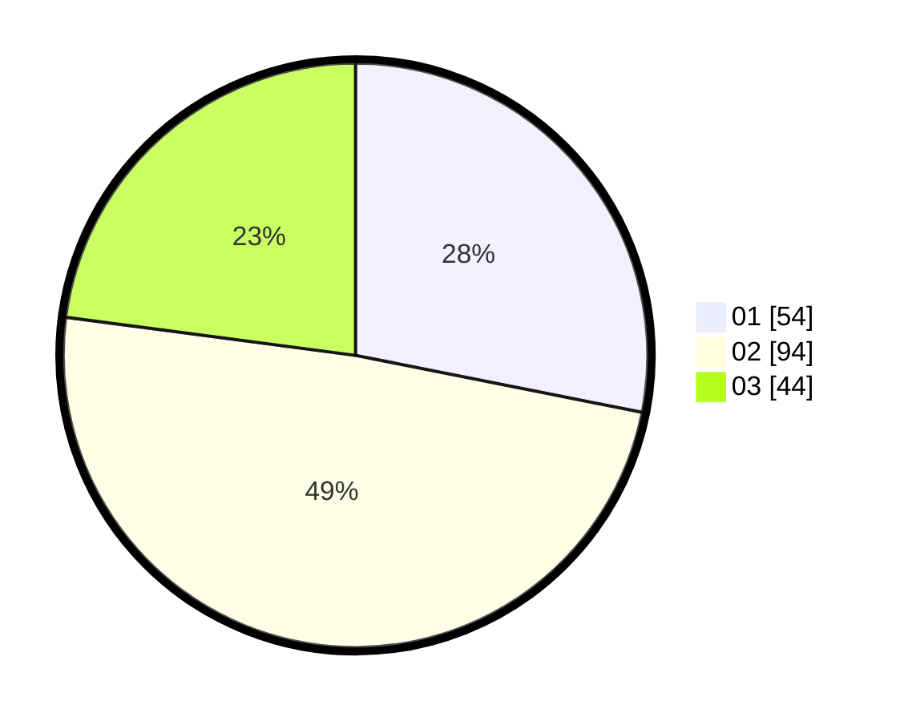

# Hasil

Hasil perolehan suara paslon dapat dilihat pada file paslon-01.txt, paslon-02.txt, dan paslon-03.txt.

Jika tidak ada, artinya data tersebut belum ada pada SIREKAP.

## Perolehan Suara

 * Paslon 01: **54**.
 * Paslon 02: **94**.
 * Paslon 03: **44**.

## Foto C Plano

https://sirekap-obj-formc.kpu.go.id/b385/pemilu/ppwp/31/73/04/10/09/3173041009074-20240214-234257--7ef6708b-4d1c-4c0b-bebf-2d991ca58399.jpg

https://sirekap-obj-formc.kpu.go.id/b385/pemilu/ppwp/31/73/04/10/09/3173041009074-20240214-234349--5ba62cf9-b8b6-404f-b7a8-ee0cde009b60.jpg

https://sirekap-obj-formc.kpu.go.id/b385/pemilu/ppwp/31/73/04/10/09/3173041009074-20240214-234441--55a7a34d-0db8-4958-aebf-a8f97a1111b6.jpg
