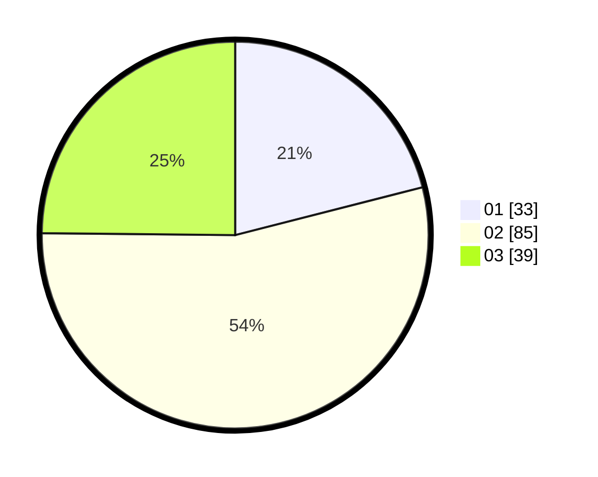

# Hasil

Hasil perolehan suara paslon dapat dilihat pada file paslon-01.txt, paslon-02.txt, dan paslon-03.txt.

Jika tidak ada, artinya data tersebut belum ada pada SIREKAP.

## Perolehan Suara

 * Paslon 01: **33**.
 * Paslon 02: **85**.
 * Paslon 03: **39**.

## Foto C Plano

https://sirekap-obj-formc.kpu.go.id/6fae/pemilu/ppwp/31/73/04/10/09/3173041009076-20240214-215720--ca90d1b6-7274-43c2-a6c9-fbf07b6d62e2.jpg

https://sirekap-obj-formc.kpu.go.id/6fae/pemilu/ppwp/31/73/04/10/09/3173041009076-20240214-215823--abf88abe-b0aa-4447-8c39-0b66cf0ad451.jpg

https://sirekap-obj-formc.kpu.go.id/6fae/pemilu/ppwp/31/73/04/10/09/3173041009076-20240214-215937--86f84b2b-c951-459f-a5e9-46d93e6afb32.jpg
