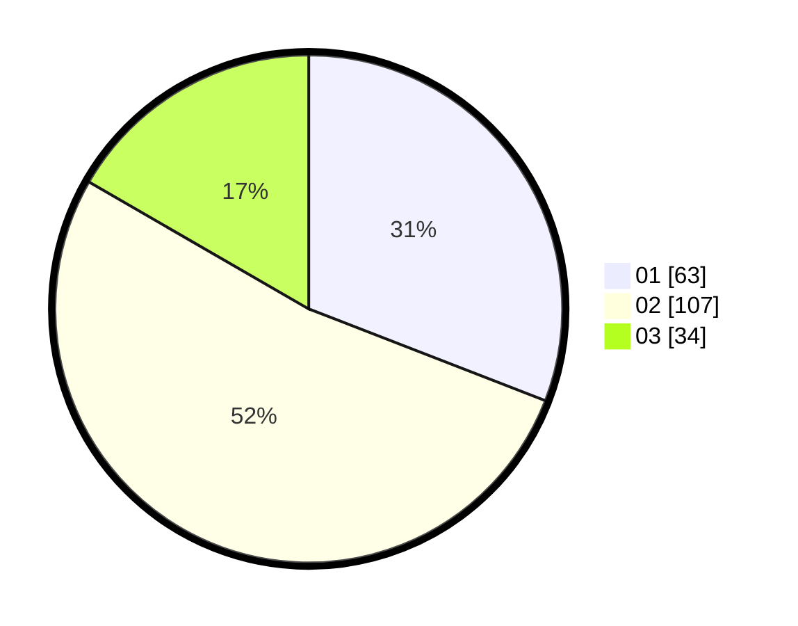

# Hasil

Hasil perolehan suara paslon dapat dilihat pada file paslon-01.txt, paslon-02.txt, dan paslon-03.txt.

Jika tidak ada, artinya data tersebut belum ada pada SIREKAP.

## Perolehan Suara

 * Paslon 01: **63**.
 * Paslon 02: **107**.
 * Paslon 03: **34**.

## Foto C Plano

https://sirekap-obj-formc.kpu.go.id/0e2e/pemilu/ppwp/31/73/04/10/09/3173041009078-20240215-044602--e6e1fe8e-3d1d-49ef-8329-cd0279929baa.jpg

https://sirekap-obj-formc.kpu.go.id/0e2e/pemilu/ppwp/31/73/04/10/09/3173041009078-20240214-212020--8267c0c9-eae4-475a-b458-5b04dd6935df.jpg

https://sirekap-obj-formc.kpu.go.id/0e2e/pemilu/ppwp/31/73/04/10/09/3173041009078-20240215-044444--c839c921-cae5-4228-b5ae-414431d0c754.jpg
